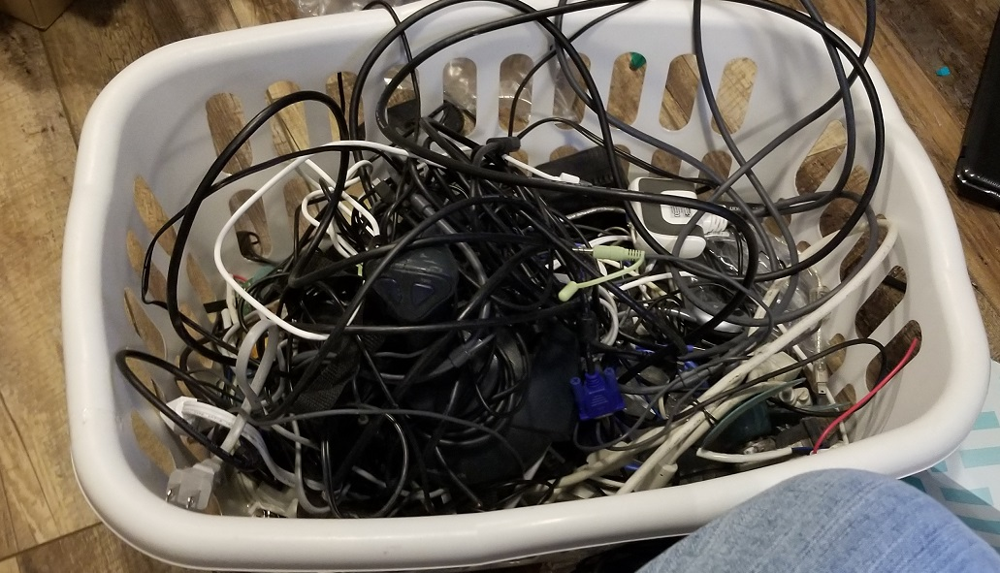
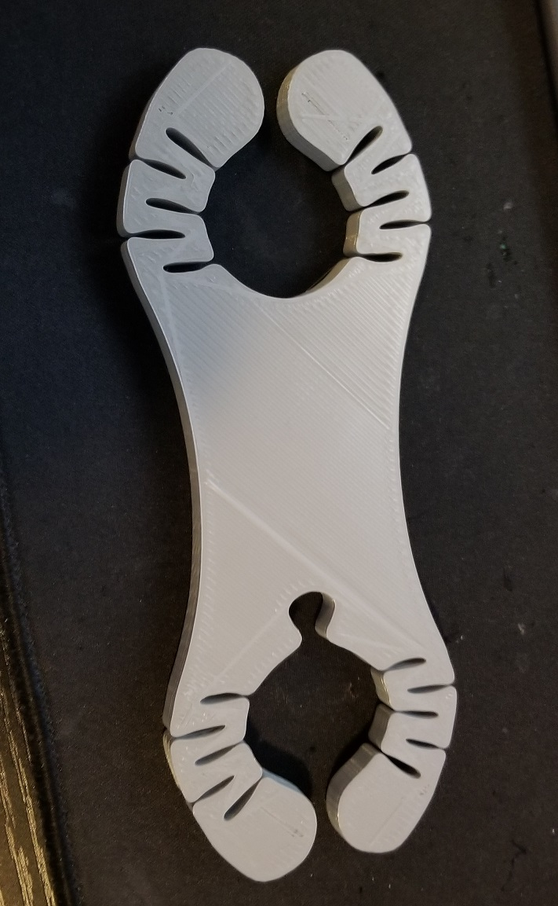
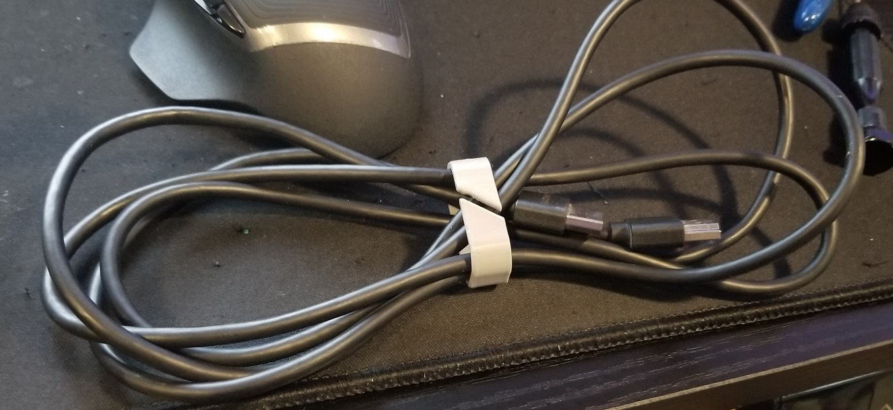
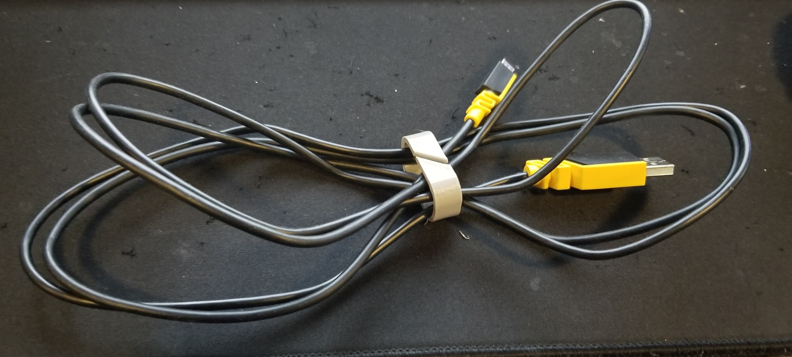
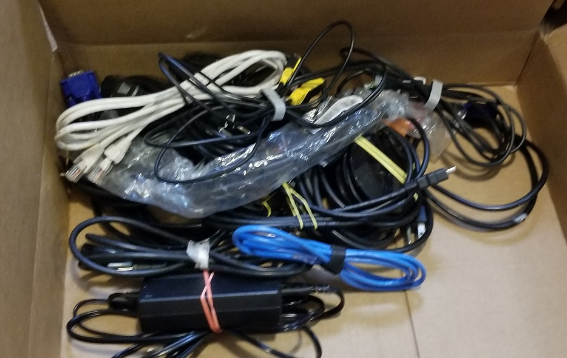
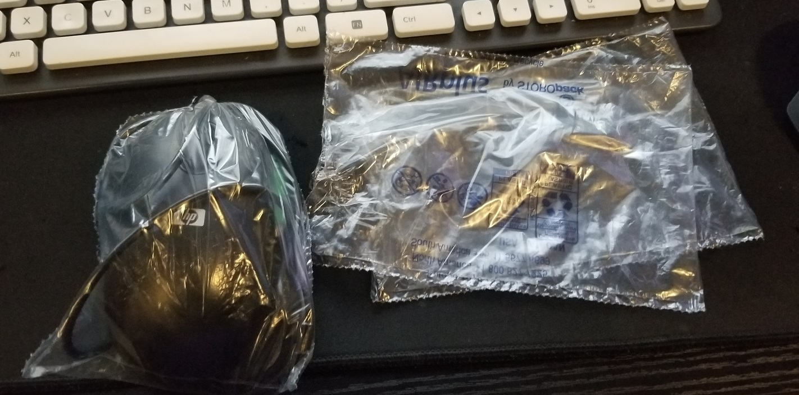

# April 13th, 2020

## Back filling notes

These notes were added 4/25/2020 based on memory and images found

## Project reduce wire storage

Had a project idea to clean up my wires. I was using a basket to store wires and have likely been using this basket for years. I have no memory when it started but it easily could have been in use for 5 years or more. The basket is very dirty and filled with old wires. Which makes me think its very old.

The goal is to sort the wires and properly store them. This way I can easily find what I need and not have to worry about tangling wires on each other.

Explored thingaverse for prints, downloaded a lot of pontetial parts but only printed 2 parts.

## First print

This part looked amazing but honestly didn't do what I needed. I did end up later reusing it for holding my snake camera-light.

## Second print

Worked a bit better but still wasn't 100% what I needed. Either way I printed several and ended up just using rubber bands on the remaing cords.

## Reused amazon air bags

Had this idea a while back and finally started using it. Picture included I'm storing an old mouse to prevent the coord from getting messed up. I ended up storing several mice this way. As well am using them for 3D print storage.

