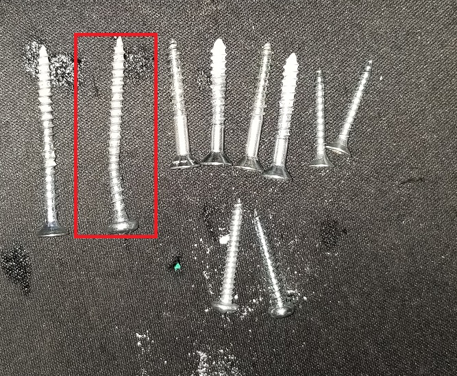
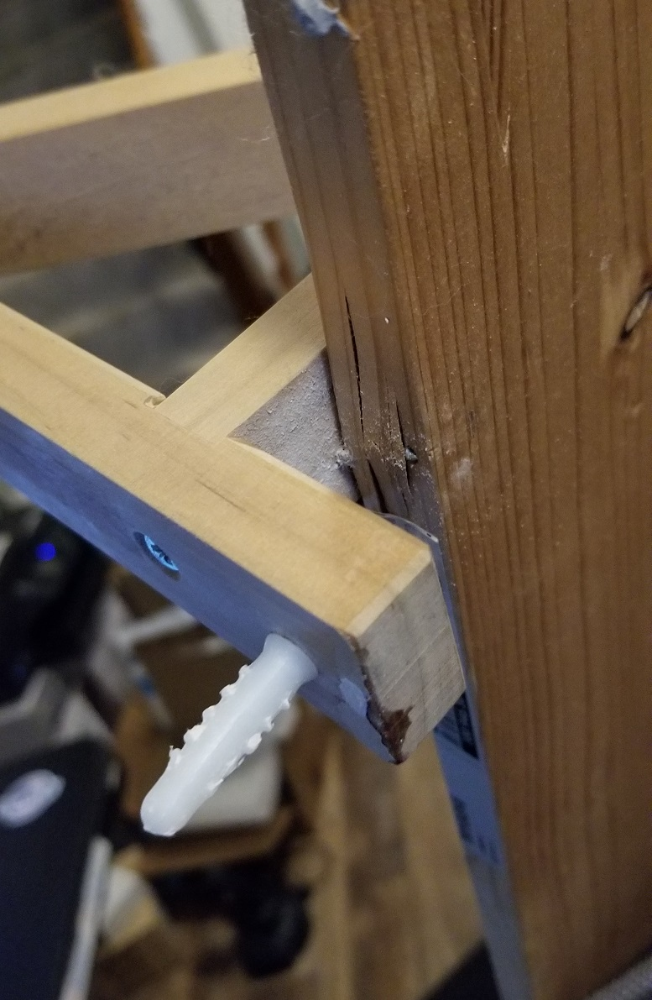

# April 15th, 2020

## Back filling notes

These notes were added 4/25/2020 based on memory and images found

## Rage at bad qualility

Finally stopped being lazy and dismantled the shelves that broke earlier in the month. Doing so showed why they failed and sort pissed me off beyond reason. Not only did these fail due to being installed wrong. They also failed due to being assemblied wrong.

In the above image you can see the screw bend and stretch during failure. This was due to the weight of the books. However, what you can also see is only 2 long screws for the 4 in total installed in the wall. The remaining screws came from teh wood and were all different sizes. Not sure if this was by design of the factory that created the Ikea kit or the person who installed it fucked up.

here you can see the screw was not installed in the right spot. As it didn't bend but rather ripped the wood. This makes me think it was drilled and installed off center. How I didn't notice this when I moved in I don't know. Either way its a rather shit shelf. It likely was only built for a few pounds and with it being installed wrong the most you could set on it was decorations.