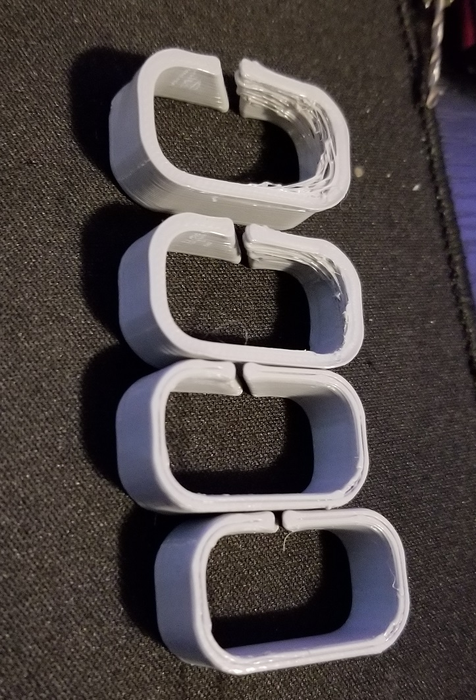
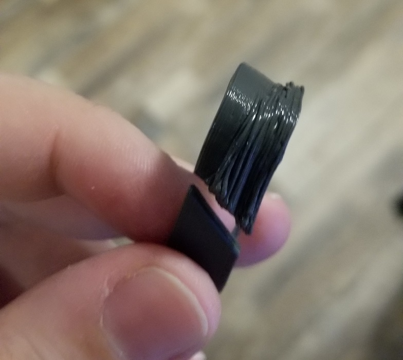
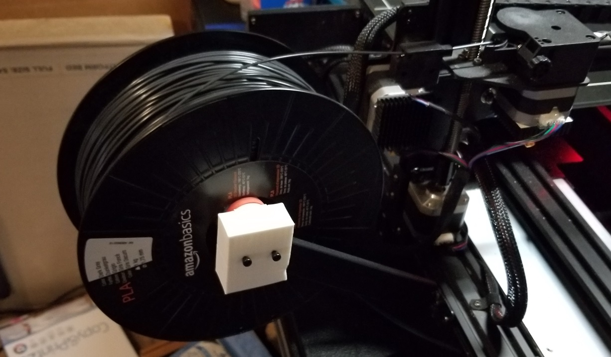
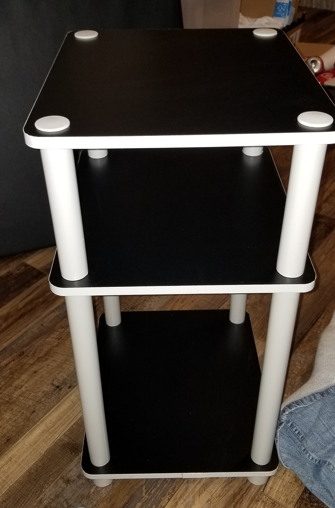
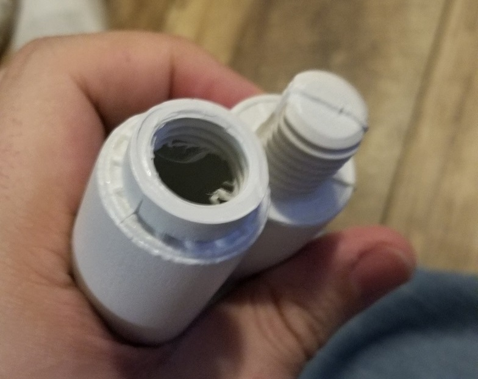
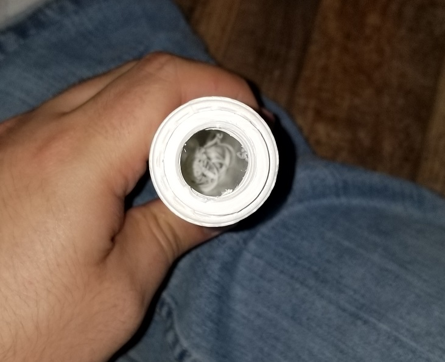

## April 19, 2020

## Idea for a design

The cube design I have been using has a lot of flaws. Its rather difficult to print, and a pain to put together. This is partially due to the holes that were added for bolts and the defects in it's 3D model. To work around this I should create my own designs. This will give me exposure to 3D design and let me toy with concepts.

My current idea is to design a print that is effectively a 1x1 stud with some length. Then work from this to create joints to effectively create a modular building system. I likely could find one if I look hard enough online. However, this will be good as I can customize for my use cases.

## Design

I ended up going with a 200mm long, 20mm high, and 20mm width stude. Each side has a 10mm by 10mm hole in each end. This would be simple enough to print and if it fails printing it will be easy enough to fix with post processing.

I used https://www.tinkercad.com/ for the design. To create the holes it required inserting empty cubes in each end. I think this is how the software is design to do cut outs. In blender there is a process for this as well but it merges down into vertex data.

https://www.tinkercad.com/things/dheO57yHrut-200mm-x-20mm-x-20mm-stud

## 3D printing design

Decided to design my own 3D print. Gave it a few tries printing. The results were good for 200mm length. The first print I stopped half way to check how it was printing. It looked good so I stopped it and went to sleep. As I was unsure if the print would finish fully due to lack of supports in the square holes in either side. 

## Random print pictures

Editing this 5/25/2020 to include images from the day. Found these images but neglected to remark about them in my notes.

I think the context for this image was 4 wire holders I had printed. Not sure when I printed these but as you can see from right to left the quality dropped. These were printed using the same file and settings. The PLA was grey hatchbox and has given me no problems before. However, this clearly shows part failure as it kept going. 

From what I can remember I was printing these to run the remaining filment out. So it could be the end of the roll was going bad or the roll kept snagging. It might even be possible the bed was dirty. As I do not clean it often when printing the same parts over and over again. Only at the start of a new day or new part set do I clean it well. Even then only light cleaning as I only do heavy cleaning once a week. In which I scrap the bed and clean it well with 99% cleaner.

----

This one Was one of the first parts I printed with the amazon PLA. It clearly failed badly and I think I recall having several print failures with this file before stopping.

----

Picture of the PLA installed, this had been sitting unpacked for a few days before installing. When I got it the PLA was in a simple box and packaged using really cheap plastic. Unlikely hatchbox which does a very thick vacume sealed plastic.

----

Got this cheap table months ago on amazon and finally put it together. It was rather sad in its quality. The boards were cut out ok, but were not finished well in the holes. Its like they cut the shape, applied plastic veneers, and then cut the holes. The tubes were even worse. It looks like they were plastic injection molded and then drilled out. You could still see the plastic shavings in the inside of the tube.

