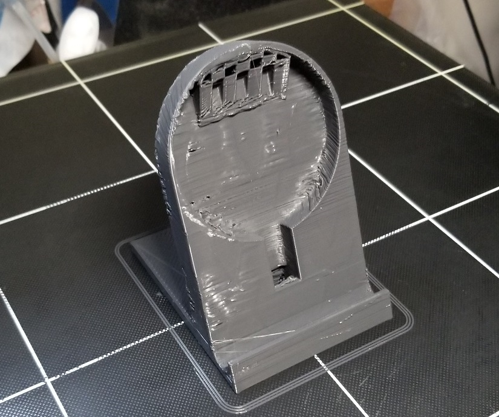
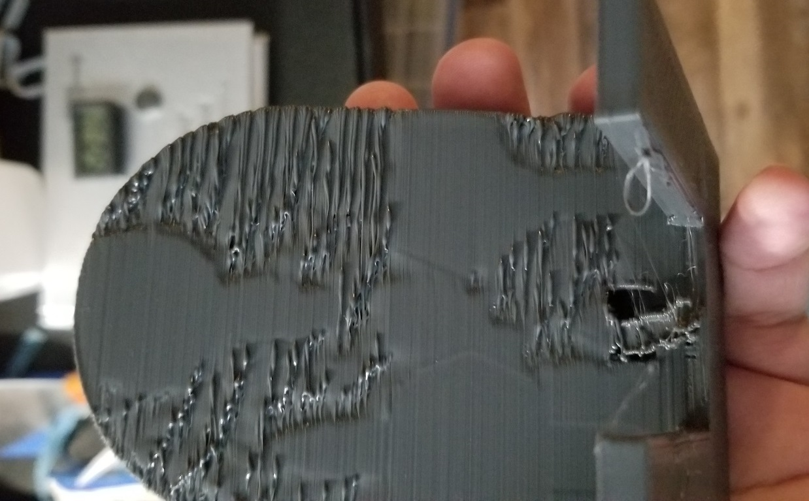
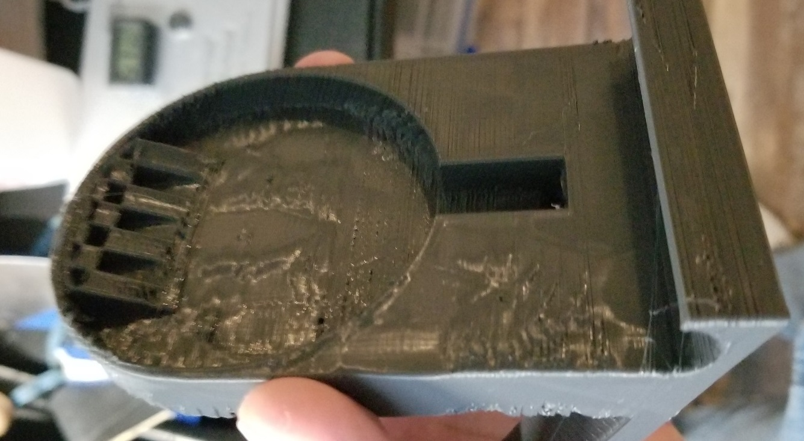
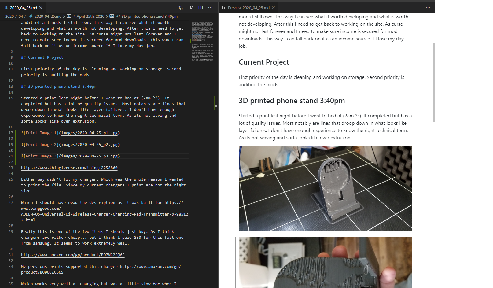
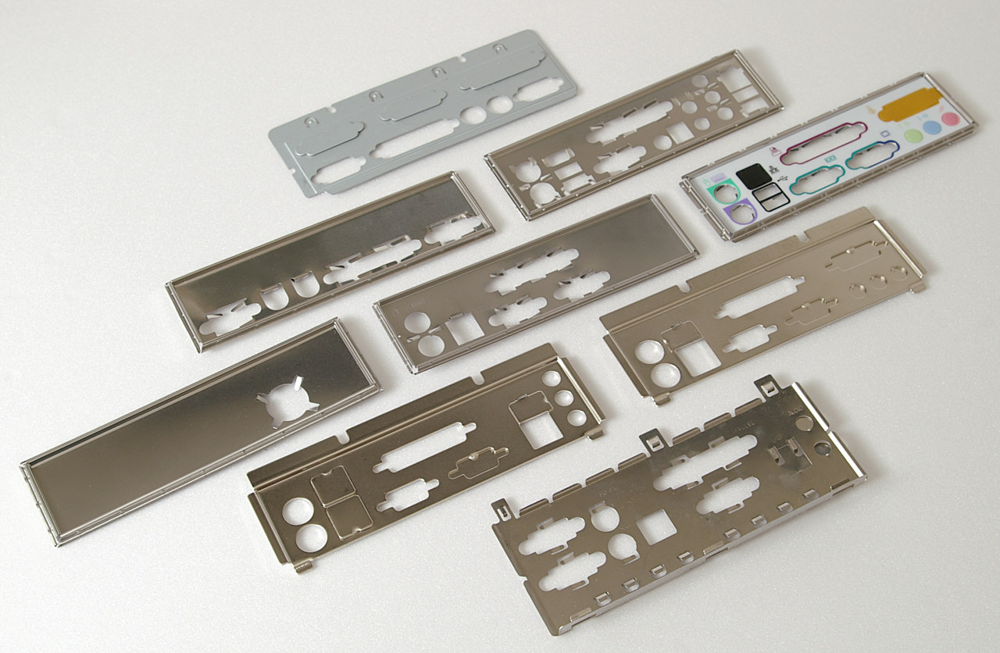
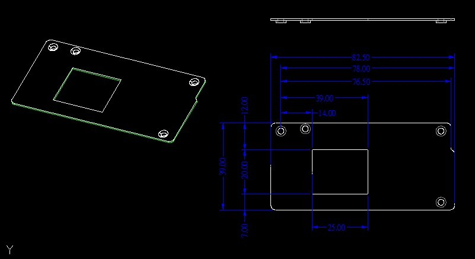

# April 25th, 2020

## Current Thoughts 3:30pm

Current thoughts is i'm tried and have no idea what I want to do today. I should focus on cleaning up the workshop and looking into updating mods. As I need to come up with a plan B for income if my day job starts to fail. I doubt it will happen as I've proven myself useful. However, there is always the chance the company itself fails more and results in additional layoffs to save money. Regardless of how good I am at my job I can still be layoff if there is no money.

As for the mods I think two big goals stand out. First is doing an audit of all mods I still own. This way I can see what it worth developing and what is worth not developing. After this I need to get back to working on the site. As curse might not last forever and I need to make sure income is secured for mod downloads. This way I can fall back on it as an income source if I lose my day job.

## Current Project

First priority of the day is cleaning and working on storage. Second priority is auditing the mods.

## 3D printed phone stand 3:40pm

Started a print last night before I went to bed at (2am ??). It completed but has a lot of quality issues. Most notably are lines that droop down in what looks like layer failures. I don't have enough experience to know the right technical term. As its not waving and sorta looks like over extrusion. 







https://www.thingiverse.com/thing:2258860

Either way didn't fit my charger. Which was the whole reason I wanted to print the file. Since my current chargers I print are not the right size.

Which I should have read the description as it was built for https://www.banggood.com/AUDEW-Q5-Universal-Qi-Wireless-Charger-Charging-Pad-Transmitter-p-985122.html

Really this is one of the few items I should just buy. As I think chargers are rather cheap... but I think I paid $50 for this fast one from samsung. It seems to work extremely well.

https://www.amazon.com/gp/product/B07WC2FQ65

My previous prints supported this charger https://www.amazon.com/gp/product/B00UCZGS6S

Which works very well at charging but was a little slow for when I left my phone near dead. Reality is I usually leave the phone on the charger all day. So slow doesn't matter all that much. Still would be useful to have a partial stand to make it so I can use the phone as a mini-display on my desk.

Guess I could design a simple stand, the shape is not exactly complex and I think I can map it out for design. Maybe design a simple circle and fill in the slack with screw mounts. Can't completely seal it off as it has a fan for coiling.

## VS Code Github Preview 4:18pm

Figured out how to use preview with github style in VS code. Notepad++ was working well enough to write the notes. However, I wanted to see the markdown as it would show in github. As this would be how I review the notes remotely.



Plugins used:

* https://marketplace.visualstudio.com/items?itemName=bierner.github-markdown-preview
* https://marketplace.visualstudio.com/items?itemName=bierner.markdown-preview-github-styles

## Image format for markdown

It does seem that markdown can't handle spaces in the file names. So the default camera upload pattern from my phone will fail when handled in markdown. There is likely a workaround but renaming the files is easier then toying with it for hours.

## Jas design request

Sent to me via discord at 3:07am, I made a comment previously I would send her cable management as a joke. She asked if I actually could and asked if I could try to design a part for her.

```

Okay, lemme get you some dims.

https://en.wikipedia.org/wiki/SMA_connector#Reverse_polarity

https://en.wikipedia.org/wiki/PS/2_port

If you can squeeze 4-6 of the former and 1 of of the latter (I'd suggest in the middle), then it'd be perfect.

Doesn't need venting.

<image of atx>

Not finding the specs immediately, but you should be able to find them on wikipedia, should be a link to the doc.

The harder part is the dims and spacing for the holes, but as I said, if you can provide a blank one, I should be able to dremel it.

(Same for the slot cover, long as you don't put slits in it)

The ITX one, I'll have to dig a bit more.

```
Provided example image:




https://en.wikipedia.org/wiki/ATX Seems to be info on the board rather than the cover but it is the source of the image she linked.

https://web.aub.edu.lb/pub/docs/atx_201.pdf PDF on the specification of ATX

https://cdn.instructables.com/ORIG/FS8/5ILB/GU59Z1AT/FS85ILBGU59Z1AT.pdf same doc?

https://www.ibm.com/developerworks/library/pa-spec9/index.html

https://www.protocase.com/resources/how-to-design-for-motherboards/

https://forums.tomshardware.com/threads/does-anyone-have-the-exact-dimension-for-an-atx-i-o-and-pci-slot-plate.2492030/

https://www.intel.com/content/www/us/en/design/technologies-and-topics/motherboard-form-factors/technical-library.html?grouping=EMT_Content%20Type&sort=title:asc

"Toward the rear of the chassis, ATX defines a stacked I/O area that is 6.25" (158.75mm) wide by 1.75"
(44.45mm) tall. "

https://www.amazon.com/Metal-Shield-Back-Plate-MotherBoard/dp/B076FVD6N3

https://www.amazon.com/dp/B00J7ZD4BQ

http://www.plinkusa.net/1uplate.htm

https://forums.anandtech.com/threads/how-hard-can-it-be-to-make-your-own-motherboard-i-o-shield.2409403/

https://www.yeggi.com/q/motherboard+shield/

This this will work, yeggi has a few decent models I can use as a template. Sent to jas to confirm that is what she needs.

Got more info from jas at 6:49pm:

https://www.fspgroupusa.com/ecommerce/ipc-psu/flex.html

```
Flex PSU size: 150*81.5*40.5 mm | 190*81.5*40.5 mm

So, 81.5mmx40.5mm plate.

Like 1-2mm thickness
```

Jas sent me a spec image at 7:49pm

https://discordapp.com/channels/@me/416450139327168532/703754355194462360



## Printed part 7pm

https://www.thingiverse.com/thing:2883646

Printed part is 160mm by almost 60mm

corners are not sharp at all so will need trimmed and some minor layering issues near the edges.

part is very flexible

Second print came out roughly the same, so it is settings issues causing the problem.


Third print data, forgot to log the first two

```
State: Printing
File: AC_Blank_IO_Shield.gcode 
Uploaded: 2020-04-25 18:15:06
User: Dark
Timelapse: Timed (10 sec)
Filament (Tool 0): 3.99m
Approx. Total Print Time: 40 minutes
Print Time: 00:32:51
Print Time Left: 7 minutes
Printed: 108.5KB / 112.9KB
Cost: $0.07
```

Printed 5 of these I/O covers. All of them came our decent and with post processing I think they will do ok.

```
State: Operational
File: AC_Blank_IO_Shield.gcode 
Uploaded: 2020-04-25 18:15:06
User: Dark
Timelapse: Timed (10 sec)
Filament (Tool 0): 3.99m
Approx. Total Print Time: 40 minutes
Print Time: 00:30:22
Print Time Left: -
Printed: 112.9KB / 112.9KB
Cost: $0.05
```

Software for print time estimate seems to be off. Not one of these matched each other for time. Average seems to have been 30 mins at a cost of 5 cents. That price is estimated on plastic cost of $22 for 1kg of 1.75mm filment PLA. As well an estimate of 10 cents an hour runtime. Which I have rounded up to account for part breakage in the future. So this part is likely a lot closer to 1 cent to produce.

That said with post processing required and low quality doubt I could sell them. As this is something I talked to my mom on the phone about. She was not very happy as she likely thinks I'm behaving like my old man. However, my idea would be custom order sells of 3D prints in general. Rather than mass production of a specific part. 

Mass production of parts would take a lot more effort and legal protection to manage. Custom parts would require minimal effort and legal protection. As I can be upfront with the custom and tell them the part is likely going to have flaws. As well can tell them not to expect it to last forever. Instead I can sell it on the idea this is a prototype or short term creation. With a lot of comments on expected qualility and examples of defects to expect. This way the customer knows that they can't expect a high quality part with a lot of post processing.

Still i'm unlikely to do this right now. As I still need more experience in 3D printing. Currently I can make a few parts and they are ok. However, I still don't know much about long term usage of printers. I could run into issues later that might prevent me from producting parts and having to refund orders. I rather avoid this and focus on prototyping stuff for myself plus friends. 

End log 00:04am next day, will continue log in next day for more printing throughout the night.