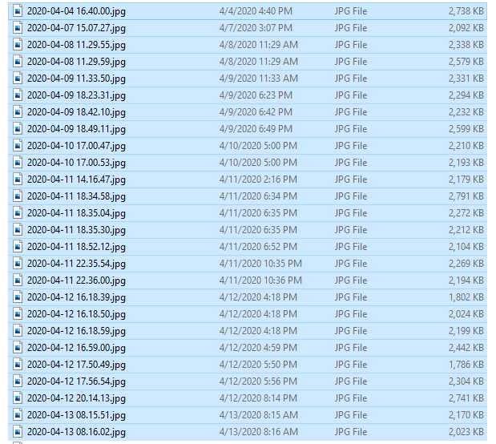
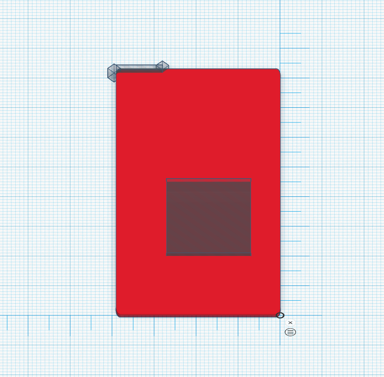
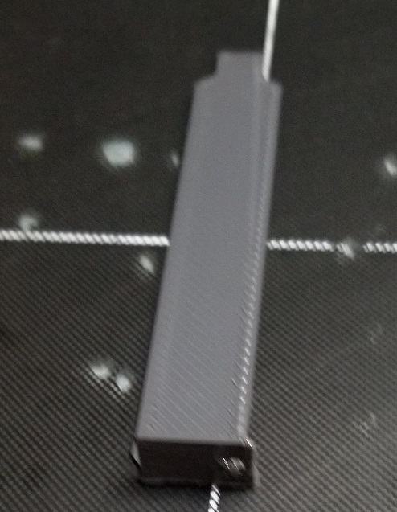
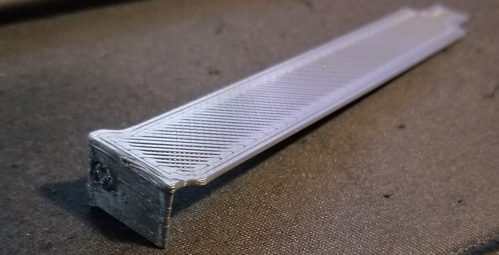
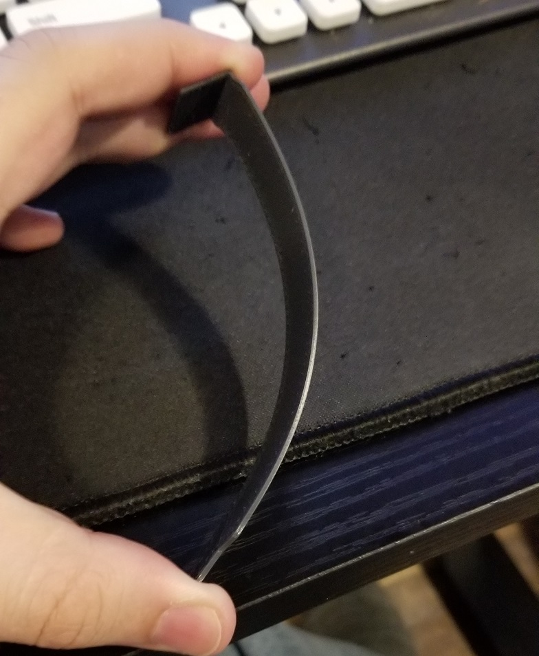
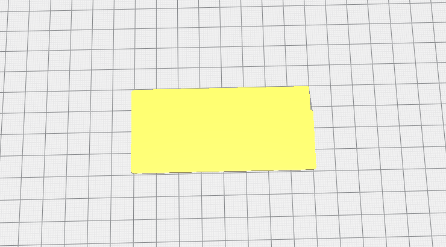
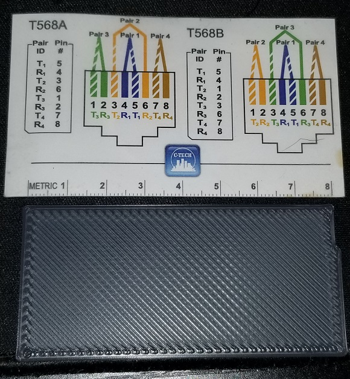
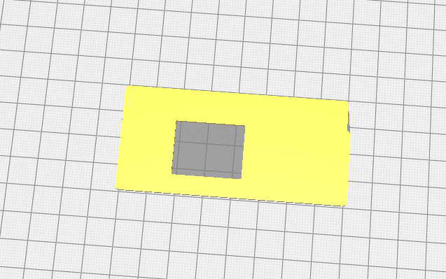
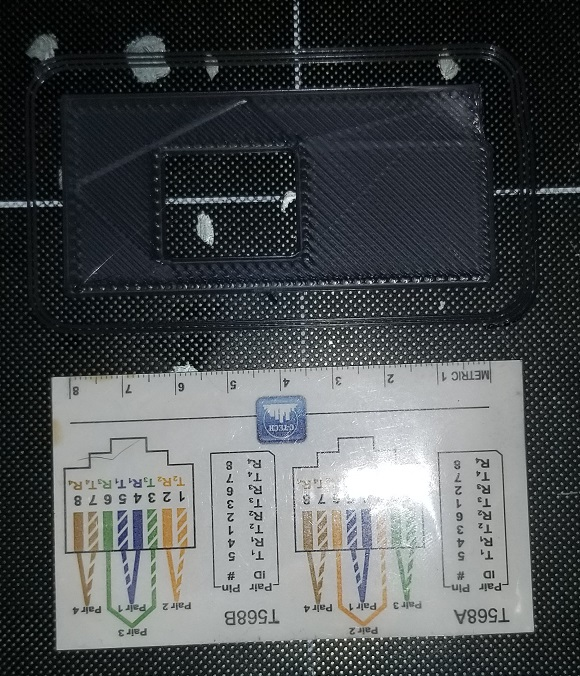
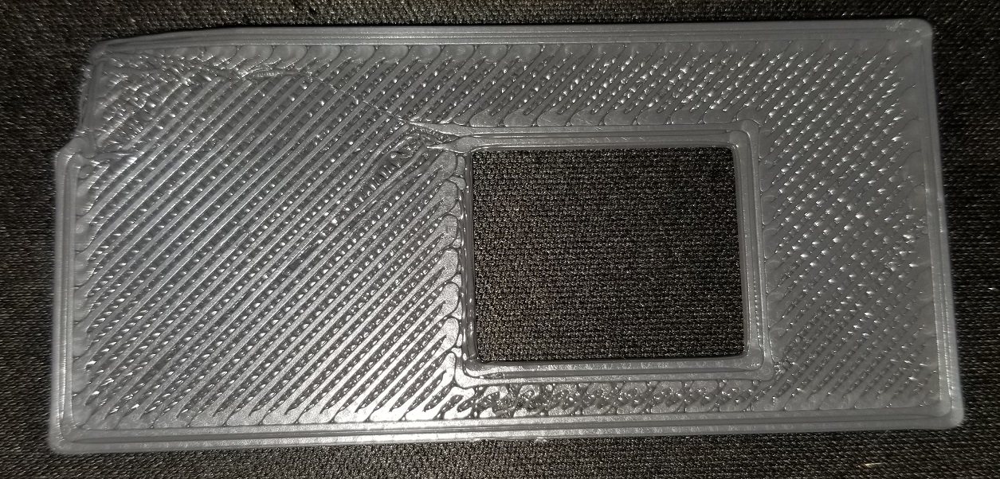

# April 26th, 2020

## Current Thoughts

00:04am - not a lot of thoughts right now. Continueing log mostly from yesterday while i'm still awake. Likely will need to update this more as I got. What I can say is I want to keep focusing on cleaning and sotrage once I get up. Though I made good progress on 3D printing and research into ATX designs for jas. I didn't manage to work on mod audits but this was second priority. As I didn't finish cleaning either and likely need to rerun laundry as I forgot again while playing arma 3 all night XD

## Back filled images

1am - Spent an hour filling in images from dropbox into notes. I need to make sure I'm doing this as I'm taking notes to avoid having to recall what goes to which section. I also noticed I have a lot of images in camera folder and screenshots for the past. What I could do is fill in some pages in the past with the images and remarks about what I might have done that day.

## Current Project

1:40am - Nothing planned for today, likely will sleep til 2pm after staying awake until 2am

2am - After adding a ton of photos to fill in backlog of notes I think I need to write an app to remove spaces from images and resize to 40% for me. As I can't use spaces when doing images and do not want to sync 2MB plus photos to github.



I also noticed I have a ton of images till in 'my pictures' to go through to see if I want to log notes for them. Tons of 3D prints and other things I've done in this month alone.

## Something about buffered WiFi


> Jas at 1:52am: Apparently bridged wifi to ethernet now works on the Pi, so I may finally be able to replace the propriatary Wifi AP's we have with fully custom.


https://www.raspberrypi.org/documentation/configuration/wireless/access-point-bridged.md

## Quick design

Quickly tried to design on an ITX part from the design I noted yesterday



Going to search https://www.yeggi.com/ for pre-made ones

https://www.yeggi.com/q/itx/

Didn't find anything useful and jas noted she didn't need the hole in the middle

## 1U things

https://www.amazon.com/s?k=iStarUSA+D+Value+D-118V2-ITX

Jas linked me this on about something about getting the 'D-118V2-ITX without the FP drivebay' not entirely sure what the context is since i'm half asleep as this point.

Turns out they are ITX motherboard cases

https://www.amazon.com/Jetway-NF9HG-2930-mini-ITX-Network-Motherboard/dp/B00XNR4HE2/


https://www.jetwaycomputer.com/NF797.html

^ Jas noted I might want one of these, not sure why :shrug:

https://www.jetwaycomputer.com/ARM.html

https://www.jetwaycomputer.com/JBC153F9HG.html

https://www.amazon.com/Jetway-NF9HG-2930-Intel-Celeron-Fanless/dp/B00XO9QUJ4

https://www.jetwaycomputer.com/JBC141F9HG.html


## ITX case design 

https://www.thingiverse.com/thing:4262498

Found this neat little case, might be useful for parts or maybe actually making it as a home mini-server

## Jas part request

Asked what I was making based on previous days

> Jas 2:53am: FlexATX blanking plate, ATX blanking plate, and a normal (Non holey) expansion bracket plate.

FlexATX is the black and blue drawing from yesterday

ATX blanks are the 5 I already printed

expansion bracket is the little flexable computer part I already printed. Given she wants either blank or holes pre-added for the following part

https://www.amazon.com/U-FL-RP-SMA-Pigtail-Antenna-Cable/dp/B005UWD0EG/

https://www.thingiverse.com/thing:1562794

Didn't take long to find

https://www.thingiverse.com/thing:3977474

https://www.yeggi.com/q/pc+case+cover+plate/ Changing filter

Couldn't find one that was modular or includes lots, going to sleep instead of keeping at it as its 3:26am

## Start of day 3pm XD

https://twitter.com/lothrazar/status/1254426759912583169

https://github.com/Lothrazar/Cyclic/tree/trunk/1.15/src/main/java/com/lothrazar/cyclic/block/solidifier

Useful code examples to use for 1.15.2 update when I eventually do it

## Chunk cache

Talked to clienthax about chunk caches, I should use these in ICBM

https://github.com/mekanism/Mekanism/pull/5692


## Power failure

5:00pm power failed, was out rougly 5 to 10 mins. Nothing seems to be damaged that is critical. Printers seem to still work but one of the PIs is not turning on. As well some bulbs blew out from the surge but were easy to replace.

## E-stop plugin

https://plugins.octoprint.org/plugins/emergencystopsimplified/?utm_medium=announcements&utm_source=octoprint&utm_content=1.4.0

Might want to read into this as a way to add safty to my printers.

Reading over the page, it seems to be a button you physically add to the printer to act as an E-stop. Was thinking it might be a sensor suit that I could add to automate some of the issues. Given it could still be useful but in those cases I might write some firmware for the printer itself. This way it stops right away and goes into cooling. Rather than what I've seen the printer do when I fire a stop command. In which it finishes it's queue then stops.

I really do need to find something to smartly watch the printer for failures. This way it can stop early without wasting time.

## Print run

Going to print off a few more plates and covers for jas

https://www.thingiverse.com/thing:1562794

https://www.thingiverse.com/thing:3977474

## file fixer script

While I'm printing i'm going to write a short script to fix the files for notes

https://nodejs.org/en/knowledge/command-line/how-to-parse-command-line-arguments/

https://www.npmjs.com/package/yargs

Remembered I had an app already close to this for joining SQL files https://github.com/DarkGuardsman/Node-FileJoiner

https://nodejs.org/api/fs.html#fs_fs_rename_oldpath_newpath_callback

## PC expansion slot cover

https://www.thingiverse.com/thing:1562794

Printed 2 of these

```
State: Operational
File: AC_bracket_022.gcode 
Uploaded: 2020-04-26 17:21:19
User: Dark
Timelapse: -
Filament (Tool 0): 1.09m
Approx. Total Print Time: 17 minutes
Print Time: 00:16:39
Print Time Left: -
Printed: 91.8KB / 91.8KB
Cost: $0.03
```

## Computer Expansion Slot Cover

https://www.thingiverse.com/thing:3977474

```
State: Operational
File: AC_expansion_slot_cover.gcode 
Uploaded: 2020-04-26 18:13:17
User: Dark
Timelapse: -
Filament (Tool 0): 1.26m
Approx. Total Print Time: 17 minutes
Print Time: 00:16:51
Print Time Left: -
Printed: 122.0KB / 122.0KB
Cost: $0.03
```

```
State: Operational
File: AC_expansion_slot_cover.gcode 
Uploaded: 2020-04-26 18:13:17
User: Dark
Timelapse: -
Filament (Tool 0): 1.26m
Approx. Total Print Time: 17 minutes
Print Time: 00:17:08
Print Time Left: -
Printed: 122.0KB / 122.0KB
Cost: $0.03
```

## Print pictures

Not sure which is which







## Regex for app 

'\d{4}-\d{2}-\d{2}\s{1}\d{2}.\d{2}.\d{2}.jpg'

'2020-04-25 18.50.30.jpg'

https://regexr.com/

## App completed 7:10pm

Finished app and installed to global by packing `npm pack` then doing `npm install -g pack.file`

Ran into issues with power shell and had to run via cmd. Seems power shell is admin locked to prevent running scripts but... cmd has no issue XD

## Jas part v2



```
State: Operational
File: AC_Jas ITX FlexPowerSupply Plate.gcode 
Uploaded: 2020-04-26 20:28:21
User: Dark
Timelapse: -
Filament (Tool 0): 1.41m
Approx. Total Print Time: 16 minutes
Print Time: 00:15:57
Print Time Left: -
Printed: 52.5KB / 52.5KB
Cost: $0.03
```

```
State: Operational
File: AC_Jas ITX FlexPowerSupply Plate.gcode 
Uploaded: 2020-04-26 20:28:21
User: Dark
Timelapse: -
Filament (Tool 0): 1.41m
Approx. Total Print Time: 14 minutes
Print Time: 00:14:24
Print Time Left: -
Printed: 52.5KB / 52.5KB
Cost: $0.02
```



## Jas part v1

Printed this even though I know it was not needed



```
State: Operational
File: AC_Jas Atx Plate (1).gcode 
Uploaded: 2020-04-26 21:19:24
User: Dark
Timelapse: -
Filament (Tool 0): 1.21m
Approx. Total Print Time: 14 minutes
Print Time: 00:14:02
Print Time Left: -
Printed: 67.9KB / 67.9KB
Cost: $0.02
```

Part quality is good, one of the corners warped while cooling. Likely can heat fix it.



Can see in the top right the corner that warps. The back surface shows some signs of printing issues



Can see in the image the top left (same corner as earlier) has some mess going on with the lines. This can also be seen in the corner near the center hole. It might be a sign the first layer is not going down well.