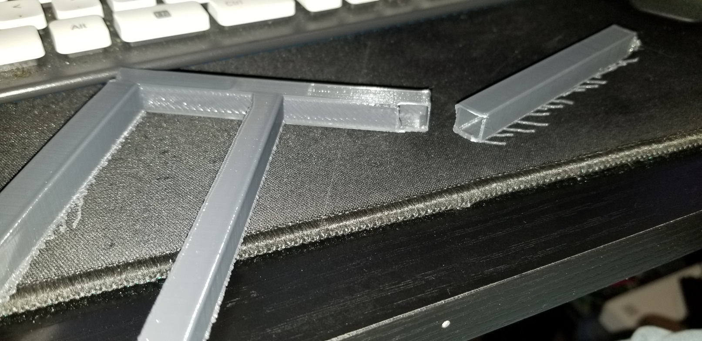

# April 27th, 2020

## Post writing notes

Neglected to take notes yesterday as I was dealing with my depression. So am filling these in the next day.

## Part break

Was toying around with the part to see what I could use it for and it snapped like a twig. Seems it had near zero infill.

## Gatzbyjs

Proxy was asking about this and I couldn't figure out what it was right away.

https://www.gatsbyjs.org/

https://www.gatsbyjs.org/tutorial/part-one/

https://www.youtube.com/watch?v=6YhqQ2ZW1sc

After some research it looks like a framework geared toward static page creation. Specifically it seems to focus on markdown and API data handling. While still providing easy access to react components for making templates and layouts. I will need to read into it more later.

## 3D printer automation

https://www.youtube.com/watch?v=fi8cms-Wnnk

Neat looking video but not very useful. Mostly came down to using smart plugs to automate on/off of the printer.

## Funny coding video

https://www.youtube.com/watch?v=-AQfQFcXac8

True video, lot of developers over engineer code including myself. Though I rarely do it to show off but instead do it to solve the "What if I need this later" menality. Thankfully I've mostly gotten out of this habit.

## OpenMW

Worked with graugger to get OpenMorrowind and ts3 working to do multiplayer. Might be a fun creative outlet to make mods for both of these softwares.

https://openmw.org/downloads/

https://github.com/TES3MP/openmw-tes3mp/releases

Graugger linked a few mods as well but didn't want to try them right away.

https://www.nexusmods.com/morrowind/mods/41102?tab=files&file_id=1000014922

https://www.nexusmods.com/morrowind/mods/47029?tab=files

Took a while to get jake setup. I keep forgetting he is not as technically set for software as me and graugger.