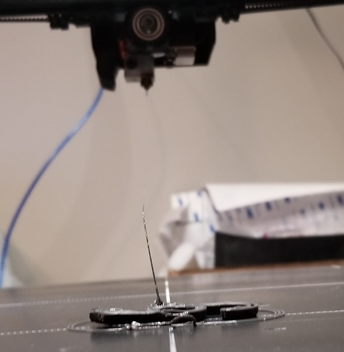

# April 28th, 2020

## Water cooling 3D printer

Something that might be neat is to water cool the print head of my 3D printer. This will remove vibration from the print head and might control the tempature a little better. Could even use this system for other areas that need cooled. Such as the stepper motors which very much get rather hot. As well the logic system that currently has some rather load fans.

Only problem with this is we need a cooling fan for the part itself. I could switch this over to an air blower rather than fan. This would again remove vibration on the print head itself.

Another bonus of this is I would remove some weight from the head and maybe make it easier to move.

## Pneumatic printer

An idea I've had before is to switch from stepper motors to pneumatic systems. This would give a lot of control and power for the system. One concern is to figure out how to measure distance of movement. Its one thing to push a part around but another to make sure its exact. Will have to do research as it very likely is possible to manage. After all factories use these systems to automate a ton of machines.

https://www.instructables.com/id/Pneumatic-Actuators-3D-Printed-Air-powered-Pushers/

https://www.yeggi.com/q/pneumatic/

https://www.engineersaustralia.org.au/News/3d-printing-pneumatic-robot-complete-working-fluids

https://www.mdpi.com/2076-0825/8/4/72/htm

## Pneumatic direct drive

Could also use pneumatic systems to directly drive filment into the print head. As one complication with direct drive systems is weight of parts. If I don't need a heavy motor I could get away with a lighter system.

## 3D printer vibrations

This large printer vibrates a lot, trying to code on my work macbook and I can feel the violent movements of the machine. I think I need to place it on a surface that is more solid and add some type of shock system.

Another idea to go with this is to build a sensor to monitor the vibrations. This way I can optimize the machine to produce less violent movements and cut down on print defects as a result. Since this vibration has to be impacting the parts.

## S-clip retry

https://www.thingiverse.com/thing:2812983

Failed 3 times

----

First failure I stopped as it was starting to come away from the board on each pass

----

Second one wrapped around the head when I wasn't paying attention

----

Third one came away and wrapped around the head after a few years

small cloth fragments are from the thing I used to clean the printer with. As the plastic had jammed into the head rather badly.

----

Between each try I claned the board and the last one I sanded it slightly to remove plastic build up on the surface. I think there is a problem with the part that makes it easy to come away from the board. It might be the curved sides.

## Cable holder with Spring Loaded Lid

https://www.thingiverse.com/thing:2690023

Going to try the large and small clips without ears from this

