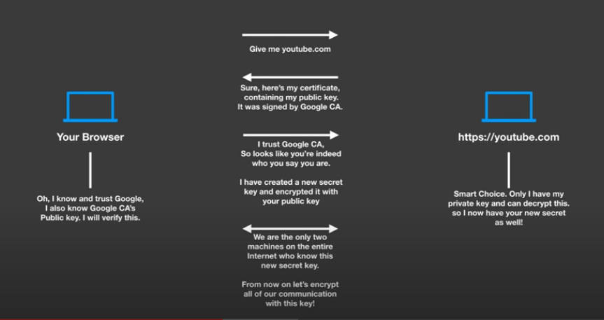
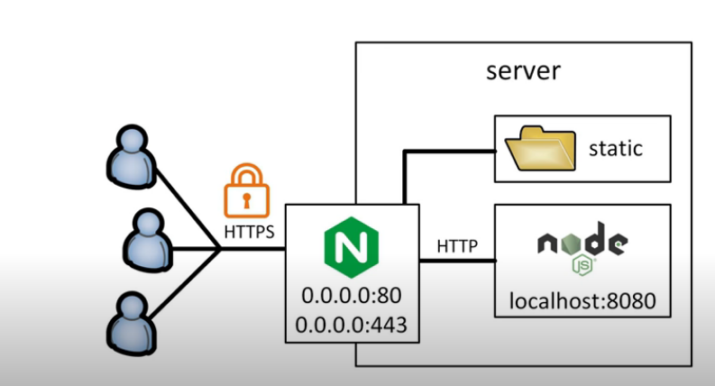

# May 6th, 2020

## SSL research for job

https://www.youtube.com/watch?v=33VYnE7Bzpk

HTTPS is the secured version of HTTP

S -> Secure

Stands for HTTP over Secure Socket Layer (SSL)

HTTPS means all communication is encyrpted

SSL certificate builds trust between a browser and server

This cert is the server's verified ID

Process works by sending the server's public key to the browser. The browser then verifies the key/cert is correct using a CA centeral authority. The browser then creats a shared key and sends a copy of his key to the server using the server's public key. The server then decodes the message using it's private key and sends all future messages using the shared key.

----

https://www.youtube.com/watch?v=T4Df5_cojAs

any message created with a public key can only be decrypted using a private key

anyone with access to a public key can verify that the message could only have been created by a private key

CA's public key is used to verify the cert sent by a server is trusted by the CA.



CA - certificate authority

CA is used to ensure a cert can be trusted.

A public and private key pair needs to be created. 

A person sends a certificate signing request to a known authory to sign a cert using this key pair. The CA then signs the request with it's private key to verify that the cert is signed using the public key.

self-signed certificate - create your own CA to sign your own keys. Process is about the same as normal CA process. It has the draw back that a user has to trust the key.

---- 

https://www.youtube.com/watch?v=CwFD_Eb_0Qo

Javascript can be obfuscated easily 

React Native is setup to force HTTPS

----

https://www.youtube.com/watch?v=d4QDyHLHZ9c



Seems we can do all the work from NGINX itself and don't need to mess with node.js side.

They use certbot to create and verify a cert.

https://ssl-config.mozilla.org/

```
# generated 2020-05-06, Mozilla Guideline v5.4, nginx 1.17.7, OpenSSL 1.1.1d, intermediate configuration, no OCSP
# https://ssl-config.mozilla.org/#server=nginx&version=1.17.7&config=intermediate&openssl=1.1.1d&ocsp=false&guideline=5.4
server {
    listen 80 default_server;
    listen [::]:80 default_server;

    return 301 https://$host$request_uri;
}

server {
    listen 443 ssl http2;
    listen [::]:443 ssl http2;

    ssl_certificate /path/to/signed_cert_plus_intermediates;
    ssl_certificate_key /path/to/private_key;
    ssl_session_timeout 1d;
    ssl_session_cache shared:MozSSL:10m;  # about 40000 sessions
    ssl_session_tickets off;

    # curl https://ssl-config.mozilla.org/ffdhe2048.txt > /path/to/dhparam
    ssl_dhparam /path/to/dhparam;

    # intermediate configuration
    ssl_protocols TLSv1.2 TLSv1.3;
    ssl_ciphers ECDHE-ECDSA-AES128-GCM-SHA256:ECDHE-RSA-AES128-GCM-SHA256:ECDHE-ECDSA-AES256-GCM-SHA384:ECDHE-RSA-AES256-GCM-SHA384:ECDHE-ECDSA-CHACHA20-POLY1305:ECDHE-RSA-CHACHA20-POLY1305:DHE-RSA-AES128-GCM-SHA256:DHE-RSA-AES256-GCM-SHA384;
    ssl_prefer_server_ciphers off;

    # HSTS (ngx_http_headers_module is required) (63072000 seconds)
    add_header Strict-Transport-Security "max-age=63072000" always;
}
```

Looks like we use the same proxy settings as normal. We just move them into the second block.

can also add `server_name testserver.io` to both

----

https://www.youtube.com/watch?v=oykl1Ih9pMg

Somewhat useful to watch but didn't contain any new info. He automated a lot of the steps so didn't gain what I needed.

https://gist.github.com/bradtraversy/cd90d1ed3c462fe3bddd11bf8953a896

----

https://www.youtube.com/watch?v=BeafoOFxIcI

Nothing useful

----

https://www.youtube.com/watch?v=tgvuQM0qgCE

Shows a docker compose, so is more useful

https://github.com/dimzrio/docker-compose/tree/master/nginx-ssl-letsencrypted

----

https://www.youtube.com/watch?v=yQ_3huavJi8

Annoying intro music

image -> application

container -> running instance

random idea I was remined of while watching this. For mrSmith app we should use docker images preloaded with software and tests to run against a mod. Can have an image with a basic modpack and a series of tests.

Was not a useful video

----

https://www.youtube.com/watch?v=HJ9bECmuwKo

https://statusq.org/archives/2016/07/03/7691/

Has a very simple example of a compose with a proxy

docker runs a DNS inside the compose to tell each container where other containers are by name.

can setup a round robin DNS lookup to act as a load balancer. This has a down side as NGINX only loads the configuration once. So if you change the scale while it is running it doesn't know about the change.

This can be fixed by adding a resolver to match the docker's DNS

```
server {

    listen 80;

    resolver 127.0.0.11; //Need to look this up if it changed
    set $upstream http://app
    location / {
        proxy_pass $upstream;
    }
}
```

NGINX can catch things for 5 mins or more. Needs to be set shorter if things are scaling more often.

----

Stuff to watch later:

* https://www.youtube.com/watch?v=YFl2mCHdv24 -> Learn Docker in 12 Minutes
* https://www.youtube.com/watch?v=4EqysCR3mjo -> Docker compose tutorial for beginners
* https://www.youtube.com/watch?v=WC2-hNNBWII -> NGINX crash course