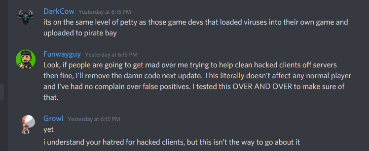

# May 7th, 2020

## Plans

Have nothing today, going to continue to focus on myself


## Asie vs better questing

12:46pm - https://charset.asie.pl/2020/05/07/russianroulette-2.html

Asie got a bit pissed at better questing. Which to be fair is very justified as the developer added a nuke for hacked clients that went well beyond what was required

```
banning the user by UUID and IP,
clearing their inventory, OP status, whitelist status, game mode, health,
disconnecting all users connecting from the same IP, including the user who tripped it,
clearing Better Questing progress and lives,
notifying all players on the server that the disconnected player was a hacker, who was auto-banned.
```

This sorta came up yesterday in MMD discord as the normal drama. The developer attempted to justify it but honestly its not justifiable. We got him to agree to remove it.

## Discord conversation from Funwayguy

https://discordapp.com/channels/176780432371744769/197165501741400064/707659828474019920

https://discordapp.com/channels/176780432371744769/197165501741400064/707711759242362989

https://discordapp.com/channels/176780432371744769/197165501741400064/707750523293663283

Discord name `Funwayguy#1405`

https://discordapp.com/channels/176780432371744769/197165501741400064/707717182556995634



## Spell book video

https://www.youtube.com/watch?v=wYBEbNbirkA

Neat video on raise undead

## Cert stuff

Asked jas about LetsEncrypt and cert stuff. Was told it likely wouldn't work on systems that are not exposed from outside.

https://cabforum.org/

https://www.thesslstore.com/blog/openssl-commands-cheat-sheet/