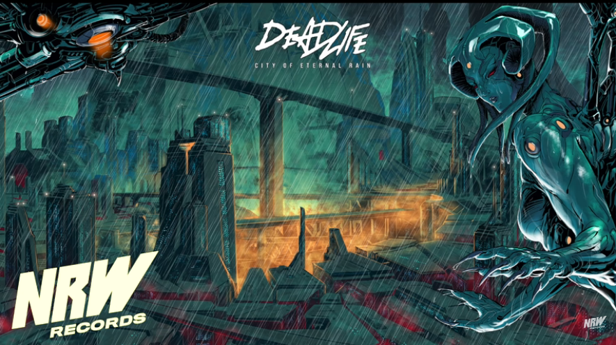
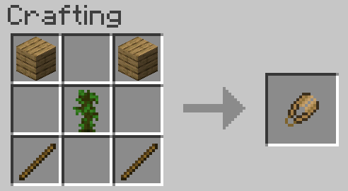

# May 10th, 2020

## Random story idea

1pm - https://www.youtube.com/watch?v=801szb2Q2zk

Inpsired a rather interesting day dream for 30 mins. Involved a cyber punk like story of a character finding himself in an unknown world. In which humans were considered like rats and were hunted by robotic humanoid like creatures. Not in a way of terminator style with humans being hunted to zero. More like humans involved into higher life and then saw anyone not like them as trash. This included a harpy like creature that was once human but turned into a machine that hunted using fear. 

Main character ended up destorying a few by shooting power orbs in the arms and legs. This didn't kill the creature completely but disabled them. The character asked how this world had changed and got a rather cold response. Part of this as well is the creature could see emotions and hunted using them. This allowed the main character to go cold and turn invisible. 

This story continued a bit with a repeat of running into the same harpy rebuilt. This time he destroyed all but the head. Which could still exist due to a power orb in the neck. The head attempted to explode after uploading its memories to a different location. The main character stopped this, not sure exactly how but ended up with the head being stored in a stassis container. Which still let the head talk but shut down all of its abilities. 

A mother and her child saw the main character destroy the harpies. Ended up leading the character to a hidden base. This is where the people at the base realize the main character is not 100% human. He has a lot of cybernetics in his body and other things that don't make sense on a scanner. Thinking he is an agent of the bad guy they surround him and start asking questions. Eventually this leads into the character revealing he has no been on the planet for 300 years and is an immortal. After confirming this they lead the main character to their boss.

Rather normal day dream like story for me to come up with. I should make a habit of writing these down as they could be good plots for games or short stories. Though they have a very marry sue vibe to them. Especially the iterations of this story. As it went through a few different changes. Start first with shooting the robotic harpies. Then it went into pulling a litteral sword from the earth to fight. Even a segment of hand to hand combat. I pulled it back to a rail gun style needle weapon. As this felt more normal and not over the top.

A few interesting bits is the handgun could fold down into a disk to be hidden. As well the harpies acted like they were better than humans but had the same mental state. The main character points this out by showing they feel emotions and act one them. Only their bodies have changed in their evolution but the mind has turned more animal like. They have become preditors that feed on fear.

Another part that I'm unsure if fits or is another segment. The character shows up on the planet via a old human ship. It drifts into orbit only to be shot down by robotic drones. It then breaks apart in atomosphere with many pods escaping. One of these pods would be the main character in a cyropod. I feel i've used this plot point a few times in day dreams. In this case it doesn't fit the story all that well. Though I think I can make it work. Pod crashed into a building and lands in a random ally. The character recovers from cyro sleep, and gets gear stored in the pod. Then find himself stuck in an unknown world not sure if its earth.

Something I like about this day dream is it has a mix of cyberpunk and matric themes. The city reminds me of a cyberpunk setting with bright lights. Shile the human hide out reminds me of the matrix movies. In which you have rusted pipes and small walkways in the same way a submarine. The humans hiding out have rather low level clothing and weapons that look over sized. Most likely stolen from drones and guard robots that were bigger then humans. 

The setting of this story would be a world where elites kept modifying them selves with robotics. Eventually getting to a point they just upload themselves into robotic bodies. With the bodies looking humand and having the same movement as a human body. Yet are still very alien in having more power, abilities, and being hard to destroy.

Something that would be useful to show is that normal weapons have no effect. Making the gun the main character has somewhat special. Could include a scene where the humans try to fight a drone only for the guns to do minimal damage. Then for the main chracter to slot a few needle rounds through weakpoints.

To not the needle rounds would be more like rectangle slivers then actual needles. 

Main bad guy would likely be modeled after a corperate elite. Someone who is evil but not in the same light as a demon. Instead he will be evil in his pure design to perfect the world in his own image. In doing so he sees humans as no longer required and tries to force upgrade them into machines that surve a key purpose. This can be shown in a lot of ways including treating even the robotic upgraded humans like trash. Think CEO yelling at a low level intern for simple mistakes.

For the main character I would like to show him as calm and calculated. A hero out of nesceity rather than desire to be the hero. For him the goal is to understand what has happened to the world. Then to set things back into balance rather than to get a reward. 

I also still want to show he has empathy and cares about everyone. This I want to depict through talking to the harpy head he carries. Eventually conviencing her that the choices she made were not good. Working through breaking down her resistance to not considering herself human. Eventually working away the ideas she holds that being a machine is the only path to greatness. Then ending in her becoming human again, either through a real body or a robotic body that looks human. Sorta a character development thing where she goes from the bad guy's monster of fear to a person with emotions & feelings. Understanding that being human doesn't mean she is weak but instead is strong by accepting what she is inside.

Another thought to take this story. The main character could be phased out for a different main chracter at some point. He might start off as the hero and help people fight the bad guys. Then push forward people to lead everyone and act as the real heros. Only to fad into the background and move to the next place that needs his help. 

This would fall into line with my earlier story ideas of the character 'intaves'. Who is a person that goes from location to location helping. Only to fad away before he becomes the hero of the story. 

To add to the context intaves is a super powerful character I created years ago. The main idea behind him was an over the top person that controlled elements with void energy. This evolved into a soldier / combat energy who was highly skilled. Who got his powers from gaia after he died in combat fighting the darkness. Gaia brough him back to life and gave him access to the void. From which tons of power flowed and allowed him to control elements. 

There is a whole dynamic behind this so I will not go into detail. Main things is he is from the future and fights an enemy called the darkness. This enemy is the inverse of light and tries to consume the universe. Intaves fought him on earth and lost. Before the earth burned he was recovered by a military team and brought to a hidden base. In this base they were working on a portal to escape the planet to another planet, stargate SG1 inspired :P. What they didn't know is the portal pulled them back 20,000 years into the paste and into a different reality. 

This goes into a whole other story line that I need to write at some point. As it goes into detail of how intaves becomes the character he is in later stories. The main thing is he develops a lot of skill and a mission to fight the darkness through creating heros. So he goes from world to world and reality to reality to help fight as he can. This results in him showing up in the the stranges of places and in odd ways in stories. He is not always the same person visually as he has no actual body. He uses his powers to create one as needed to fit the story. His powers are also scaled as required using null cystals. 

Effectivily the chracter very much is a marry sue. Way over the top and not a good fit for this story. That said I can use the concept of it to play into the story. In the same way as I use the doppelgangerous in a few stories, one of eric's designs. Which has a multi-dim character that toys with reality to see different outcomes. He goes from realm to realm to adjust a few key elements. Then watches how this will change the entire story line. I've used it a few times to make for interesting changes. Such as a weapon showing in the right place or the bad guy being led into a confortation with the hero. Small changes that result in big story elements.

Not sure what to do with this story. Its neat but not special. I also don't have enough details to turn it into a full 200 page book. So short story at best? I'll have to think about it and return to it later.

Random thought, I could have the hero win in this story by converting robots back to humans. Not through some special weapon but by talking. Having each understand that they may have changed their bodies but the souls + minds are still human. They have only forgotten what they are and have the power to change themselves... very anime style of story XD

## Review of mods projects

| Name | Owner | Latest Version | Downloads | Link |
| --- | --- | --- | --- | --- |
|  |  |  |  |  |
| SPACE | Y | Not released | 0 | https://www.curseforge.com/minecraft/mc-mods/steves-planet-and-asteroid-colonization-effort |
| Amory-ICBM sentries  | Y | 1.7 | 23,145 | https://www.curseforge.com/minecraft/mc-mods/armory-icbm-sentries |
| Armory-AA | Y | 1.7 | 7,101 | https://www.curseforge.com/minecraft/mc-mods/armory-ams |
| Basic Industries | Y | 1.7 | 8,786 | https://www.curseforge.com/minecraft/mc-mods/basic-industry |
| Artillects | Y | 1.7 | 2,394 | https://www.curseforge.com/minecraft/mc-mods/artillects |
| Armor Setter | Y | 1.12 | 27 | https://www.curseforge.com/minecraft/mc-mods/sbm-armor-setter |
| Baggable Mobs | BuiltBroken | 1.12 | 9,365 | https://www.curseforge.com/minecraft/mc-mods/sbm-baggable-mobs |
| Baggable Plants | Y | 1.12 | 12,747 | https://www.curseforge.com/minecraft/mc-mods/sbm-baggable-plants |
| Bash fire make rock | BuiltBroken | 1.12 | 1,364 | https://www.curseforge.com/minecraft/mc-mods/sbm-bash-fire-make-rock |
| Bear Trap | BuiltBroken | 1.12 | 1,655 | https://www.curseforge.com/minecraft/mc-mods/sbm-bear-trap |
| Bone Torch | BuiltBroken | 1.15.2 | 121,588 | https://www.curseforge.com/minecraft/mc-mods/sbm-bone-torch |
| BreadStone | ist_meow | 1.12 | 1,379 | https://www.curseforge.com/minecraft/mc-mods/sbm-breadstone |
| Cati Bucket | BuiltBroken | 1.10 | 8,031 | https://www.curseforge.com/minecraft/mc-mods/sbm-cacti-bucket |
| Carboard Boxes | BuiltBroken | 1.12 | 181,037 | https://www.curseforge.com/minecraft/mc-mods/sbm-cardboardboxes |
| Charcoal Block | bl4ckscor3 | 1.15.1 | 23,052 | https://www.curseforge.com/minecraft/mc-mods/sbm-charcoal-block |
| Colored Chests | BuiltBroken | 1.7 | 34,046 | https://www.curseforge.com/minecraft/mc-mods/sbm-colored-chests |
| Dead Man's Satchel | ist_meow | 1.12 | 610 | https://www.curseforge.com/minecraft/mc-mods/sbm-dead-mans-satchel |
| Dual Wither | BuiltBroken | 1.14 | 3,399 | https://www.curseforge.com/minecraft/mc-mods/sbm-dual-wither |
| Durance | Y | 1.12 | 31 | https://www.curseforge.com/minecraft/mc-mods/sbm-durnace |
| Elevators | BuiltBroken | 1.12 | 10,070 | https://www.curseforge.com/minecraft/mc-mods/sbm-elevators |
| Gas Can | BuiltBroken | 1.7 | 8,182 | https://www.curseforge.com/minecraft/mc-mods/sbm-gas-can |
| Grappling Hook | BuiltBroken | 1.7 | 15,431 | https://www.curseforge.com/minecraft/mc-mods/sbm-grappling-hook |
| Hand-Held Piston | ist_meow | 1.12 | 1,323 | https://www.curseforge.com/minecraft/mc-mods/sbm-hand-held-piston |
| Helm Bucket | BuiltBroken | 1.12 | 11,952 | https://www.curseforge.com/minecraft/mc-mods/sbm-helm-bucket |
| I just need a gun | Y | Not relased | 0 | https://www.curseforge.com/minecraft/mc-mods/sbm-i-just-need-a-gun |
| Infinite Falling | ist_meow | 1.14 | 809 | https://www.curseforge.com/minecraft/mc-mods/sbm-infinite-falling |
| Jukebox | StrikerRocker | 1.15.2 | 23,943 | https://www.curseforge.com/minecraft/mc-mods/sbm-jukebox |
| Lizard doggo | BuiltBroken | 1.15.1 | 13,639 | https://www.curseforge.com/minecraft/mc-mods/sbm-lizard-dogo |
| Magic Mirror | StrikerRocker | 1.15.2 | 10,718 | https://www.curseforge.com/minecraft/mc-mods/sbm-magic-mirror |
| Merpig | BuiltBroken | 1.15.1 | 50,143 | https://www.curseforge.com/minecraft/mc-mods/sbm-merpig |
| Midas Zombie | BuiltBroken | 1.12 | 111 | https://www.curseforge.com/minecraft/mc-mods/sbm-midas-zombie |
| Oil Ore | BuiltBroken | 1.12 | 8,562 | https://www.curseforge.com/minecraft/mc-mods/sbm-oil-ore |
| Punt Animal | BuiltBroken | 1.14 | 37,790 | https://www.curseforge.com/minecraft/mc-mods/sbm-punt-animal |
| Red Cow | BuiltBroken | 1.8 | 31,971 | https://www.curseforge.com/minecraft/mc-mods/sbm-red-cow |
| Sheep Metal | bl4ckscor3 | 1.15.2 | 27,343 | https://www.curseforge.com/minecraft/mc-mods/sbm-sheep-metal |
| Snow Power | BuiltBroken | 1.13 | 2,544 | https://www.curseforge.com/minecraft/mc-mods/sbm-snow-power |
| Wooden Bucket | BuiltBroken | 1.12 | 478,609 | https://www.curseforge.com/minecraft/mc-mods/sbm-wooden-buckets |
| Wooden Rails | BuiltBroken | 1.7 | 33,726 | https://www.curseforge.com/minecraft/mc-mods/sbm-wooden-rails |
| Wooden Shears | BuiltBroken | 1.15.1 | 5,747,516 | https://www.curseforge.com/minecraft/mc-mods/sbm-wooden-shears |
| Wool Anvil | Y | 1.12 | 21 | https://www.curseforge.com/minecraft/mc-mods/sbm-wool-anvil |
| Addicted to Red | Y | 1.7 | 22,600 | https://www.curseforge.com/minecraft/mc-mods/addicted-to-red |
| AI Improvements | Y | 1.15.2 | 9,257,431 | https://www.curseforge.com/minecraft/mc-mods/ai-improvements |
| Assembly Line | Y | 1.7 | 37,366 | https://www.curseforge.com/minecraft/mc-mods/assembly-line |
| Atomic Science | Y | 1.12 | 89,002 | https://www.curseforge.com/minecraft/mc-mods/atomic-science |
| BBM Test Pack | Y | N/A | N/A | https://www.curseforge.com/minecraft/modpacks/bbm-test-pack |
| BBM's Armory | Y | 1.7 | 26,604 | https://www.curseforge.com/minecraft/mc-mods/the-armory |
| Box of Crates | Y | Not relased | 0 | https://www.curseforge.com/minecraft/mc-mods/box-of-crates |
| Come Closer | Y | 1.12 | 4575 | https://www.curseforge.com/minecraft/mc-mods/come-closer |
| Dark's Tools and Utilities | Y | 1.7 | 2,515 | https://www.curseforge.com/minecraft/mc-mods/darks-tools-and-utilities |
| External Announcements | Y | 1.12 | 5,751 | https://www.curseforge.com/minecraft/mc-mods/external-announcements |
| Fallen Kingdoms | Y | 1.7 | 19,360 | https://www.curseforge.com/minecraft/modpacks/fallen-kingdoms |
| Growmeal | bl4ckscor3 | 1.15.1 | 3,171 | https://www.curseforge.com/minecraft/mc-mods/growmeal |
| ICBM-Classic | Y | 1.12 | 1,816,845 | https://www.curseforge.com/minecraft/mc-mods/icbm-classic |
| ICBM-2 | Y | 1.7 | 575,455 | https://www.curseforge.com/minecraft/mc-mods/icbm |
| Ishihara | Y | 1.12 | 47 | https://www.curseforge.com/minecraft/mc-mods/ishihara |
| Military Base Decor | Y | 1.7 | 46,219 | https://www.curseforge.com/minecraft/mc-mods/military-base-decor |
| MFFS | Y | 1.7 | 157,929 | https://www.curseforge.com/minecraft/mc-mods/mffs |
| Might Vision Decay Fix | BuiltBroken | 1.7 | 496 | https://www.curseforge.com/minecraft/mc-mods/night-vision-decay-fix |
| Ohms | Y | 1.7 | 651 | https://www.curseforge.com/minecraft/modpacks/ohms |
| Progressive World Cleanup | Y | 1.7 | 1,188 | https://www.curseforge.com/minecraft/mc-mods/progressive-world-cleanup |
| Resonant Engine | Y | 1.7 | 47,472 | https://www.curseforge.com/minecraft/mc-mods/resonant-engine |
| The deep Dark Below | Y | Not released | 0 | https://www.curseforge.com/minecraft/modpacks/the-deep-dark-below |
| Universal Electricity | Y | 1.7 | 45,911 | https://www.curseforge.com/minecraft/mc-mods/universal-electricity |
| VE-FluidHandling | Y |  1.12 | 436,704 | https://www.curseforge.com/minecraft/mc-mods/ve-fluidhandling |
| Volts 2.0 | Y | 1.7 | 3,405 | https://www.curseforge.com/minecraft/modpacks/volts-2-0 |
| Volts Classic | Y | 1.7 | 4,957 | https://www.curseforge.com/minecraft/modpacks/volts-classic |
| Volts M12 | Y | 1.12 | 1,309 | https://www.curseforge.com/minecraft/modpacks/volts-m12 |
| Voltz Engine | Y | 1.7 | 752,537 | https://www.curseforge.com/minecraft/mc-mods/voltz-engine |
| Wool buttons | bl4ckscor3 | 1.15.1 | 2,343 | https://www.curseforge.com/minecraft/mc-mods/wool-buttons |
| Workshop | Y | Not released | 0 |  https://www.curseforge.com/minecraft/mc-mods/workshop|
| World of Boxes | Y | 1.12 | 2,432 | https://www.curseforge.com/minecraft/mc-mods/world-of-boxes |

Not sure why I built this list, its next to worthless in markdown. Either way I can target a lot of the SBM mods for fast updates to help motivate myself.

## Mods to target for update

* Wooden shears 1.15.1 -> 1.15.2
* Wooden Rails 1.7 -> 1.12 -> 1.15.2
* Armor Setter
* Baggable Mobs
* Baggable Plants
* Bash fire make rock
* Bear Traps
* Elevators
* Midas Zombie

## Wooden Shears

Seems to work on 1.15.2 out of the box

Got a new version pushed and approved.

Reworked configs and registry to use streams. Configs are also stored on Enum stream lining the code.

Found something to fix loot tables

https://github.com/cech12/CeramicShears/blob/1.15/src/main/java/cech12/ceramicshears/loot_modifiers/CeramicShearsLootModifier.java

4pm - Got it applied and it seems to be working. Only implemented it for oak so need to do the other types. Should just need to add more conditional tags to the look table entry.

9:30pm - Add the other types around 5pm. Will need to do more testing in the morning as I ended up gaming instead of checking it. Too tired to try it now and need to cleanup anyways before publishing. So I can do this in the morning when I have time.

Also need to remember to write a change log and clean up the curse repo a bit.