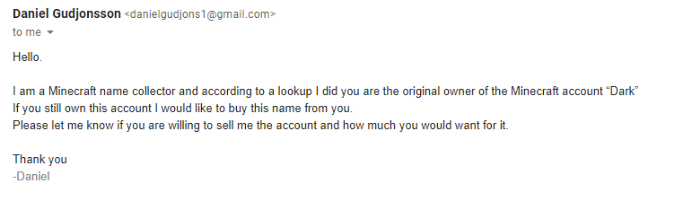
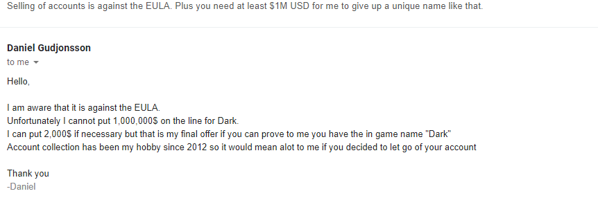

# May 14th, 2020

## Plan

Nothing, still focusing on self... might try to work on ICBM

## Notes

10am - someone tried to buy the account "Dark" from me. Which I don't recall owning but decided i would see how this goes. Sent a replay saying its against the EULA and would need $1M USD for it.

My guess is that its a bot spamming an email list looking for anyone stupid enough to sell the acount for $5 USD or less. 

----

11am - upcraft shared https://docs.docker.com/compose/compose-file/#volumes as a solution to docker volumes being created. Saying I can use named volumens and force drive settings to cause it to fail if files are missing.

