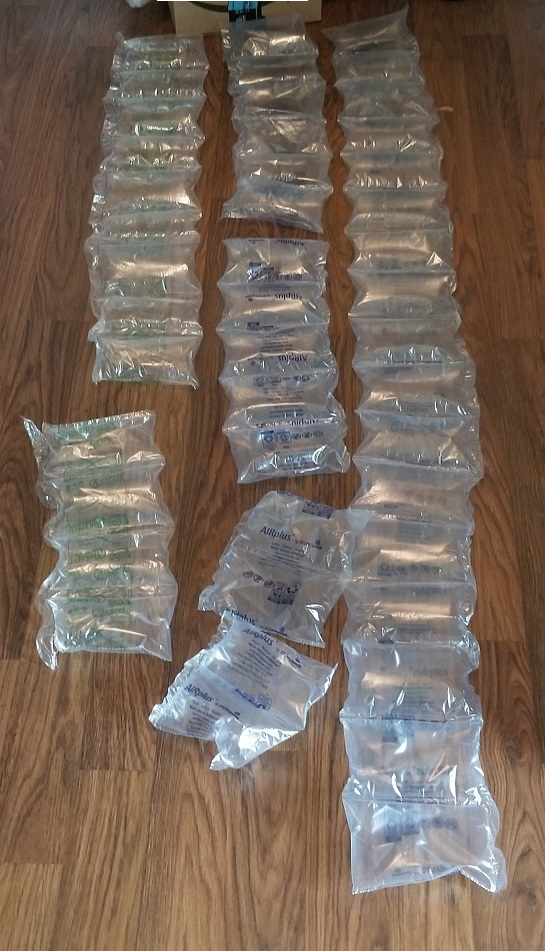

# May 15th, 2020

## Plan

None at all

## Amazon waste

Bit amazed at how many of these air bags I got in 3 packages.

Going to cut off the tops and use them as storage bags for cables. Seems to be the best way to reuse them. Plus I rather reuse them rather than throwing them away. 

Still very much overkill as the one box had plastic cups and folding cutting mats for food. Nether item really needed this much protection. Hell I'm rather sure nether item would suffer damage during shipping. That sad the box was smashed... so guess it was useful.

Second package was gum, had 3 of these things in it. Not exactly required but guess they ran out of that brown paper stuff.

Don't recall what was in the other package... but assume the next few that show up will also include a lot.