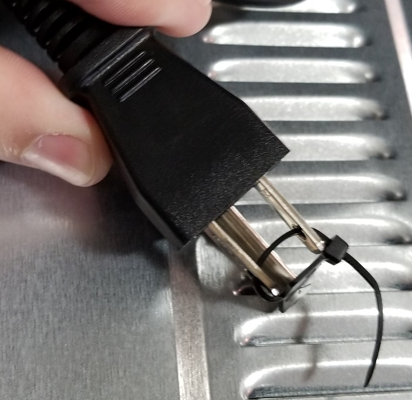
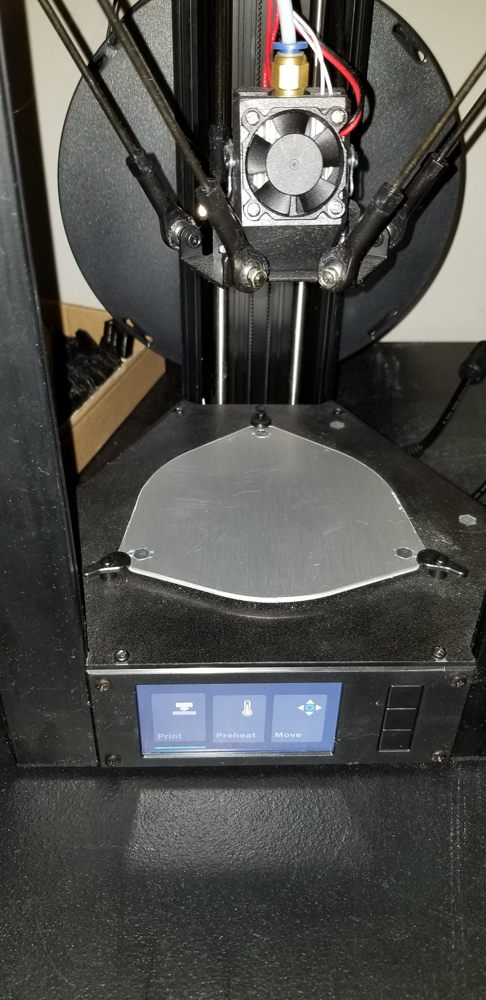
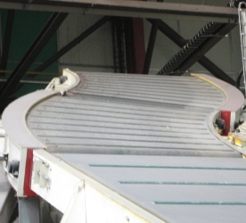

# May 16th, 2020

## Plan

Maybe work on a mod ?

## Plug

Got a new toaster oven, and it came with a zip tie on the plug

Feels rather stupid and should have been one of those full sized protector plugs.

They should have used one of these instead. As it can easily be reused to store the device again later.

## Fixing desk

So an issue that has been happening for a while is the cables keep falling under my desk for the lift system. This resulted in me a few days ago disconnected the cables disabling the system. Which was better then catching my legs on the cables. Left unchecked it would have destroyed the cables and system with it.

Today I think I want to try to fix this. My first idea is to use brackets to screw the cables into the desk. I gave this a try last week I think but realized the thing ones I had used screws that are too large for the wood.

This means I need to consider 3D printing some of the ones I used for the server power cable. Problem is the larger print is still not fixed for alignment and honestly has issues printing small things. So I guess I need to fix the small printer first. It should just need a new pad installed and will go back to working well enough.

## Whiteboard desk

https://getrocketbook.com/products/thinkboardx-2

Saw this a few days ago and remembered about it in an email.

Its $12 for a sticker that goes on your desk. You can get a whole roll of these for $8 on amazon. That can cover several desks.

Wow they have a larger version

This is very much over priced for a product that cost less then that.

## Window thing

Been using some old packing foam to diffuse light in my window next to my desk. Mainly so people can't see into the basement but also to break up sharp beams hitting my eyes. Something I noticed is the UV light has been heating up the foam and changing it's shape.

At least my theory is this is what is happening... but I can't confirm if it wasn't already like this due to how it was stored. It is possible I rolled it up and stored in it a location. As I noticed another foam of the same material has a slight bend like this as well. It could be just gravity as well. Though it does match a little too well with the blinds.

## Working on a frame

Decided I wanted to do some wood working to create a frame for the 3D printer. Tried to do this by hand... got the amazing idea to use my desk to hold a board so I can square drill another. This worked until I realized I didn't messure the holes. Placed then 25% from the edge rather than centered. 

Graugger went into a whole thing where I could use heated pins or something... this is over kill but templates is something I can do. So created a template off the end of a 2x4. Which is actually 1.5 by 3.5 inches... still the template works and I can drill holes much better.

Wood is not very square

Failed to drill holes at a 90, defeating any effort to use a template. I should have got a jig for this.

Still it worked and I got a somewhat 90 degree joint

Got the otherside done and tested its size. Ya nothing was checked before I started this project. It was entirely "I have some wood lets make something". Which is fine but its magic that it worked for the size requirements.

Got the full frame built, looks nice but very much is not square due to warped wood. Still came out nice.

Got the whole thing setup and mounted into the table.Its not very pretty but it works. I Secured it with two chunks of wood under the table. As the 3 inch screws stuck out rather long under the table. Was concerned I would hurt myself while crawing under to get boxes later. Plus the wood chunks help reduce how much it moves. As its not very well supported due to the table being hollow blow molded plastic. So it is easy to twist it side to side. Version two I will likely build a full box frame.

Added padding around the printer to reduce noise. Egg holder looking one is held in by wires. Other two use thumb tacks. Very much will get nicer materials later to help reduce noise but its what I had to spare. Which is good as two of theses are recycled shipping materials I saved. Love getting to reuse waste materials.

Setup my tool holders on the otherside. Finally got to use these things even if they are not that great.

Next goal is to setup the small 3D printer which was the whole point of cleaning the room and making this frame. As I wanted to clear up space and get mroe organized.

## Dirt world mod

Had a random idea from discord chat to make mobs from dirt. The idea would be a very plant filled world where plants carried the dirt with them. So you could have a vine like zombie that its body was solid dirt. This could be expanded to all mobs. Including replacing slimes with a silt like clay. 

## Monoprice mini-delta 

Got it setup again, new pad installed, and test print works

----

Printer before things were installed

----

Pad that was installed, big larger then the printer plate

----

Can see the pad didn't go on that easy and likely should have been cut before installing. Either way it aligned well and printed well. Printer still has issues with letting out plastic at the start. I should get some wipe code from cdlord to solve this issue. As it would be easy to add a brush next to the plate to clean the head between prints.

## Cable clips

Going to print some of these for the desk wire issue

https://www.thingiverse.com/thing:2839355

First print went well, way better then the larger printer. 

## Cura issue

Ran into cura crashing on loading, turned out one of the plugins was corrupted. Had to delete it from the appdata/roaming/cura folder.

ThingiBrowser was the plugin

Best guess is it was trying to load an endpoint and was failing. As I already knew the plugin stopped working ages ago.

## Curved conveyor

Just realized curved conveyors are actually mechanically complex. Was trying to think through how I would 3D print one and realized I actually don't know. Can't seem to find much information on how they work either.

---

Found this https://www.central-conveyors.co.uk/conveyors-take-corners-like-ronaldo/

Honestly not even sure how this works. Maybe it uses guides to keep the belt onto the rollers?

---

https://www.safeconveyor.com/Conveyor-Turn-Module.php

This one makes sense as its just two belts.

---

Roller design, which also makes sense due to it being just spaced roller bars.

----

http://www.conveyor-manufacturers.co.uk/Gallery/belt-bend-conveyor-photos.html

http://www.conveyor-manufacturers.co.uk/html_files/Conveyor_Belt_Bend_Corners.html

https://www.youtube.com/watch?v=tNtF5ad43vw

> C-Trak have a range of #Curve and #Bend #Conveyors with True Axis #Modular Belting.

I think the blue tray/railing holds the belt in place. Allowing for the belt to flex without pushing out of the guides.

https://www.youtube.com/watch?v=203-qW36aYQ

---

https://www.youtube.com/watch?v=YOrcWKeuIsA

https://www.youtube.com/watch?v=Wxl20eA8wsU

https://www.youtube.com/watch?v=ImI2R_FFNk0

https://www.youtube.com/watch?v=JGaIs_fJx4U

https://www.youtube.com/watch?v=kWsUem33_ro

https://www.youtube.com/results?search_query=3d+printed+conveyor+belt

---

https://www.youtube.com/watch?v=ZoxecLtQ9Pw

Interesting and simple 3D printed belt

---

https://www.youtube.com/watch?v=mo3IvrBnOnA

Another simple design though sounds horrible

---

https://www.youtube.com/watch?v=CjN7UhdMPOo

3D printed factory

https://www.roboternetz.de/community/threads/69561-Mein-neues-Projekt-Die-kleine-Mischerei?p=630277#post630277

https://www.youtube.com/watch?v=64w4cXR4jnI

This stuff is down right impressive.

---

http://www.abacusdesign.org/examples2.htm

---

https://cablevey.com/tubular-drag-conveyor/

Not sure what a drag conveyor is but it looks amazing

> Our cable and tube conveyor technology feature the combination of conveyance tubes with cables and discs attached at set intervals. This design serves to gently handle materials from an inlet to discharge by holding materials between the discs within an enclosed tube. Materials are not blown about or forced around sweeps. They’re carried without bumping, battering, stress or friction. Breakage is thereby kept to a minimum. For fragile materials, safe handling means the difference between profitability and loss.

Full name is 'Cable & Tubular Drag Conveyor Systems'

Could make for an interesting mod based system. You would have a hopper one one end. Then could loop to another hopper. Then loop back to the start.

Could even have several stages to allow mixing items and setting up chain crafting.

Step 1 -> input

Step 2 -> add item

Step 3 -> add item 2

step 4 -> craft

step 5 -> furnace

step 6 -> eject item

step 7 -> eject waste items

step 8 -> return to start

---

http://www.flexibleconveyorsystems.com/Pharma.html

Very simple looking system

Love the simple look of it. Has a very hobby like design to it.

---

https://www.industrysearch.com.au/rexnord-magnetflex-combi-x-corner-track-for-conveyor-systems/p/152698

Neat looking image showing sorta how the belt flexes on corners

---

https://www.directindustry.com/prod/iwis-antriebssysteme-gmbh-co-kg/product-15428-1621175.html

