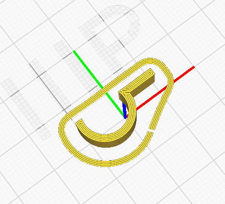
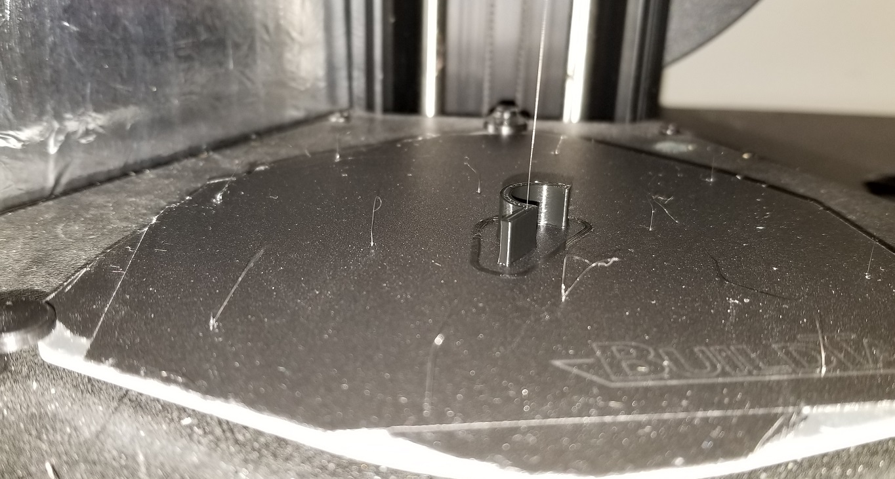
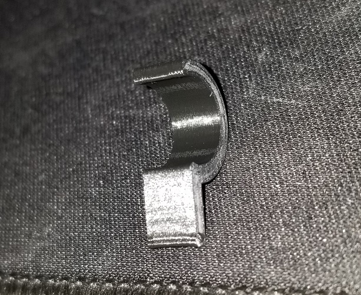
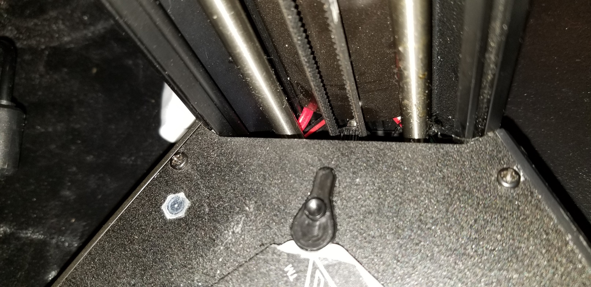
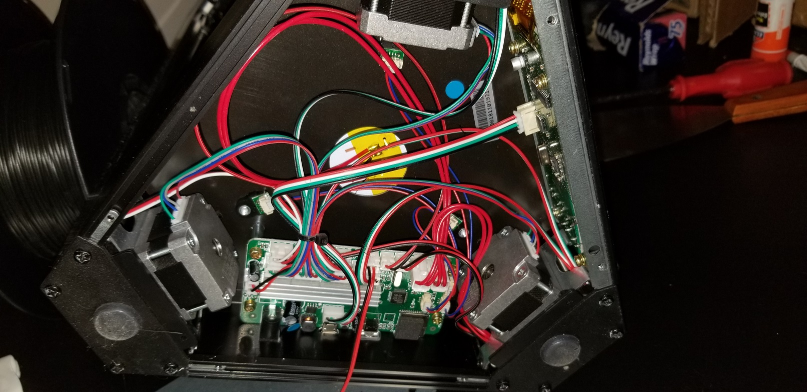
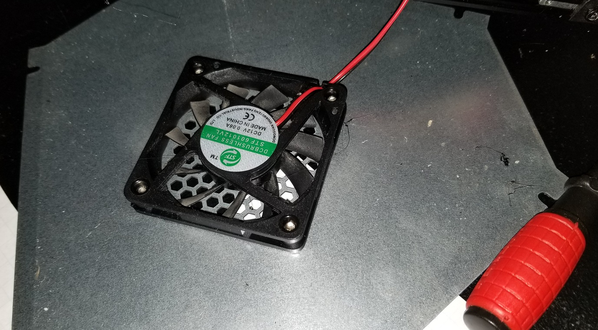
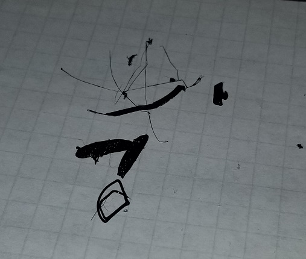
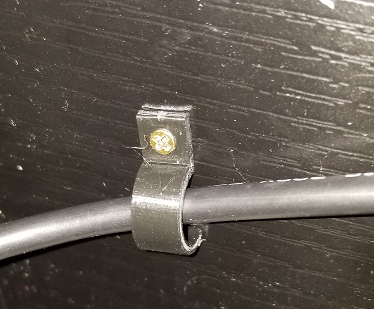
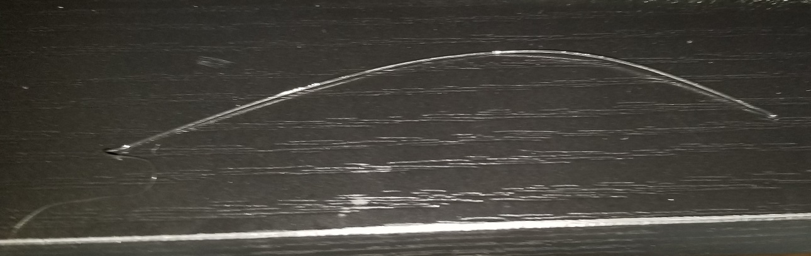
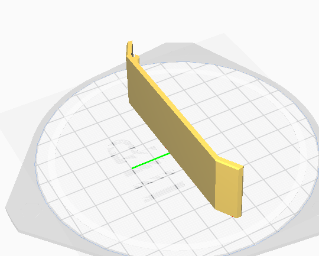

# May 17th, 2020

## Plan

Might work on 3D printing stuff

## Graugger modified part

Got graugger to remove the hole from the part

print turned out good, printed off another 5 of them after removing the skirt around the part. As it was too hard to remove.

---

Had a part flop into the side panels of the printer

Took the bottom off but couldn't access the part

Noticed a lot of 3D timings fell into this area or were sucked up by the fan

Ended up just turning the printer upside down and shacking it. The part dropped out with other stuff.

---

Installed the clips

## Extra plastic

Printer is letting out a few inches of filment at the start. 

Going to print some plates to help reduce this problem

## Plates to cover holes

https://www.thingiverse.com/thing:3036081

## Research for head wiping

https://www.mpminidelta.com/nozzle_cleaning

https://www.mpminidelta.com/starting_ending_g-code_scripts