# May 18th, 2020

## Plan

Maybe work on some software projects

## 3D printed fan duct

Going to print a fan duct for the chiron to improve cooling of the parts

https://www.thingiverse.com/thing:3054313

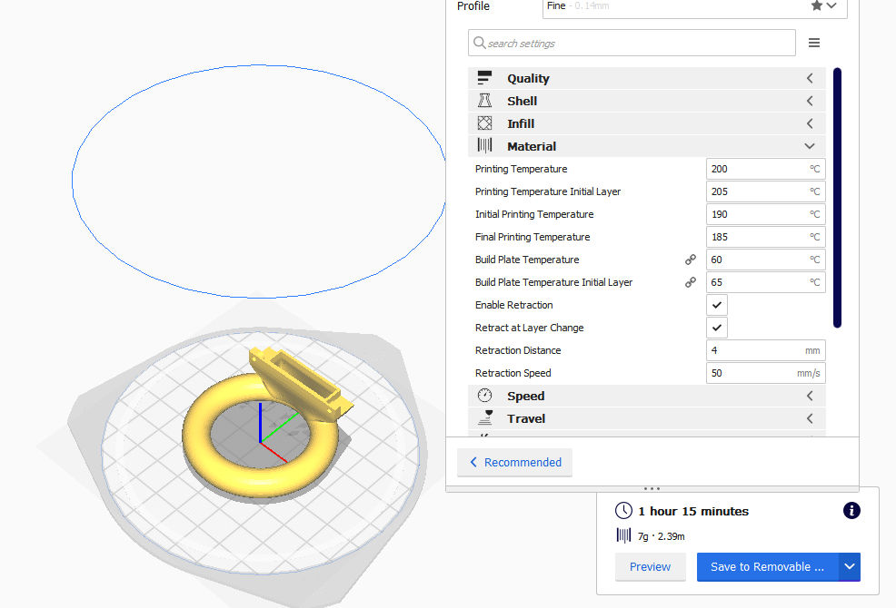

Part printed with only minor cosemtic issues

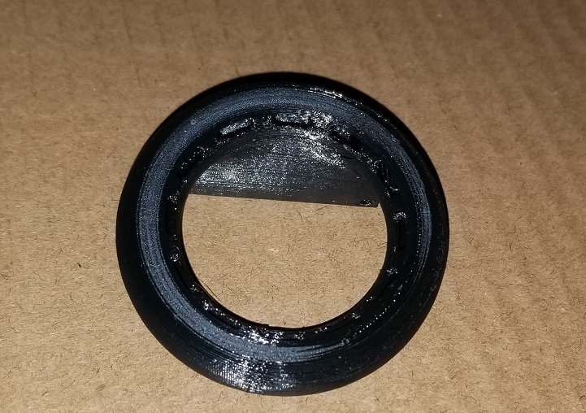

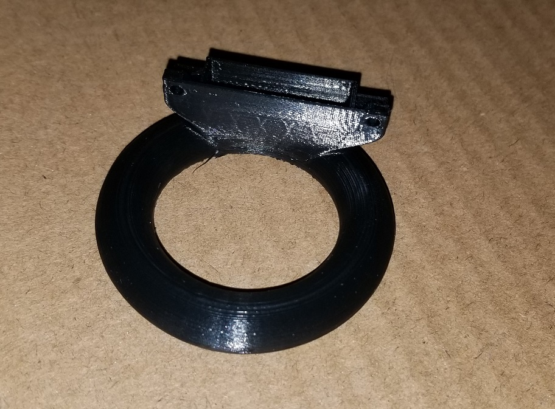

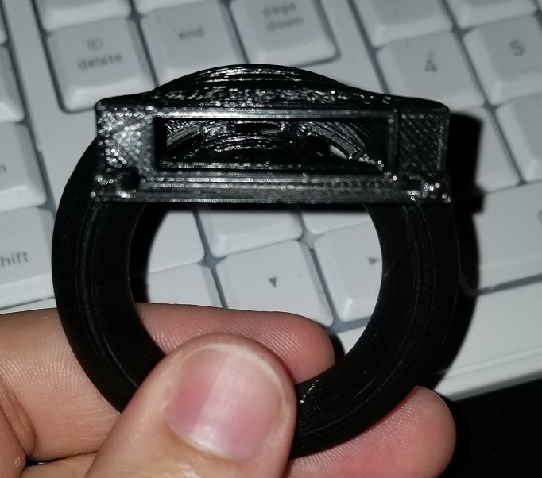

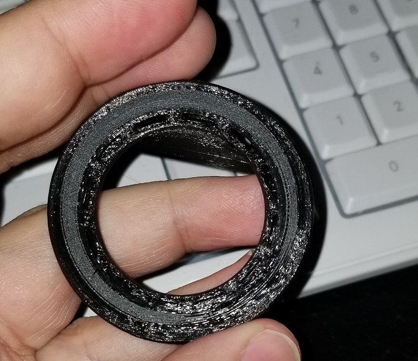

Main issue I noticed is some delamination on the bottom. Likely didnt bond well with the plate and came free.

---

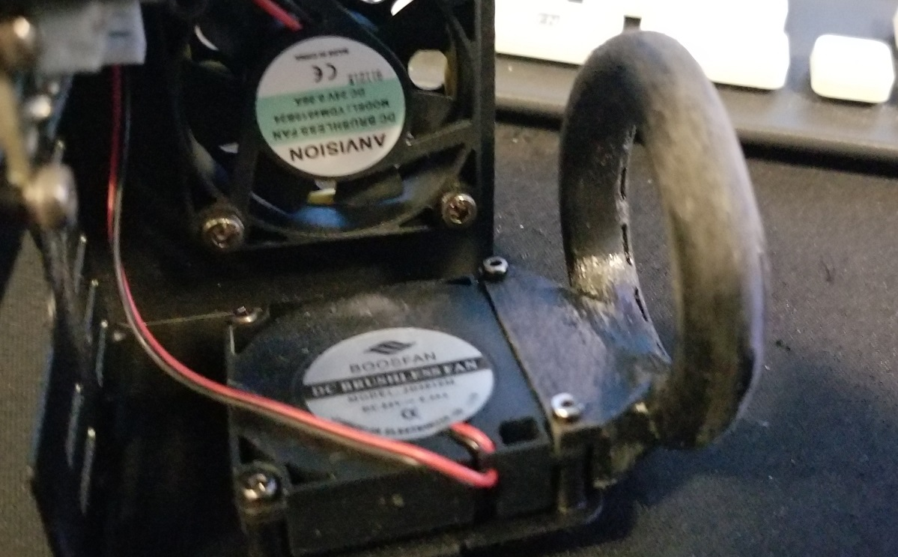

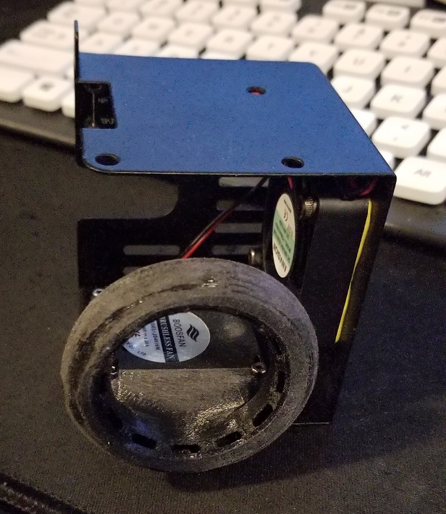

Found out after installing this that you can't mount it on the machine with the duct on. So had to remove it and install it again. This was rather difficult as I had to thread the bolts in from the other side. I figured out after 10 mins of pain that I can pre-thread the bolts before install. Then move the tool into place to finish it off. This worked perfect for one side but the other ran into issues with hitting the hot end & one of the bearings. I did manage to force the tool into place just enough to get it attached well. Though I think it would have done fine without screws or just 1. As the part fit like a glove and was rather tight.

## Mini-delta burning smell

Seems there is melted plastic around the head and under the insulated cover. I'll need to take the head apart later and apply a new casing to it. Right now I don't think it is a danger but it does smell bad.

## Mini-delta cable rubbing

Noticed the cable rubbing on the printer previously. Decided to take a look today and realized I can remove the top plate without issues. Used the screws from the top plate to hold in a few rubber bands solving the problem. Will install LEDs in place of the top plate later as well.

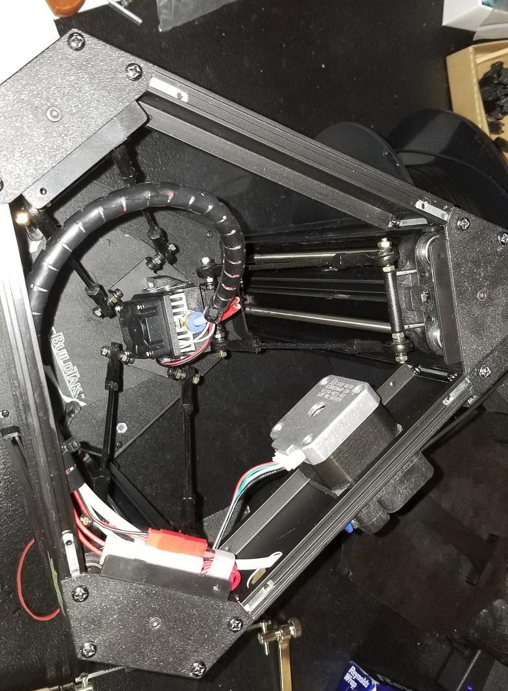

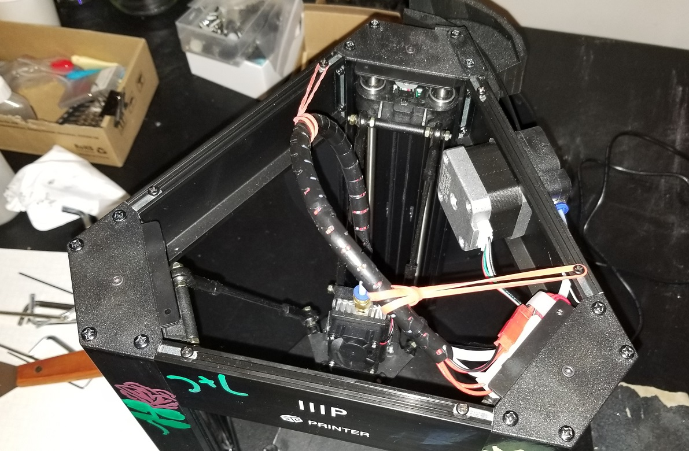

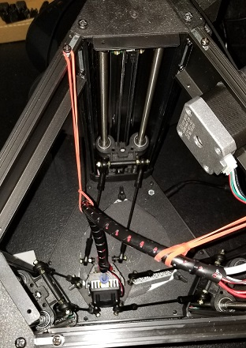

## Tempature sensors

Bought some tempature sensors that finally showed up. Should be useful for checking tempature of rooms and areas. Might use them later for the printers as well.

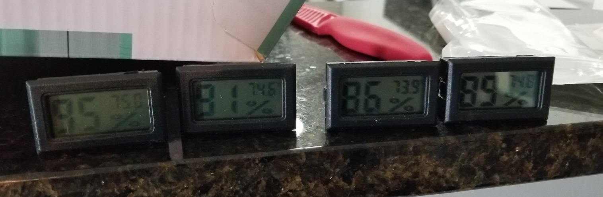

Picture right after I opened them. Can still see the near 100% humidity they detected from being outside while it was raining.

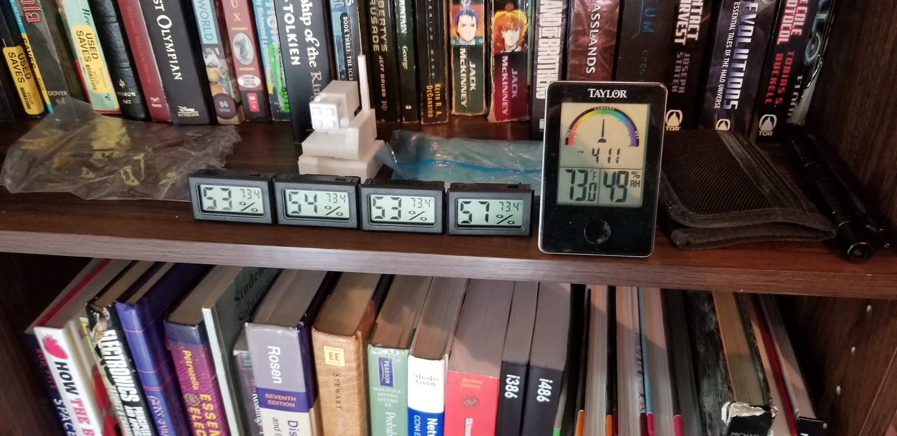

After a few hours they stabalized but we can see the difference in +- in the readings. In theory all 4 should have the same value.

## Random print

Printed on the cherion and it failed, sorta as it did print but just didn't print at all well.

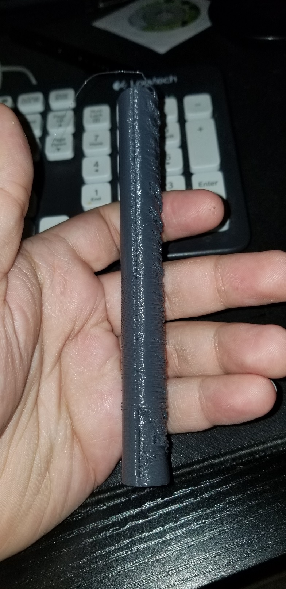

Cooling fan never turned on. Took the casing off, which I figured out how to do without removing the cooling fan. You can tilt the casing down near the bottom and loop it off the hot end. 

As far as I can tell the wires look fine on the fan. Couldn't tell what was wrong so went to re-install the housing. Lost both of the screws but managed to replace them with M3x4 screws I had.

Tried a few more prints which also didn't work. Couldn't get the fans to turn on via terminal as well. The main fan seems to work but the secondary fan is not working. Hope I didn't jam the motor or damage the wires.