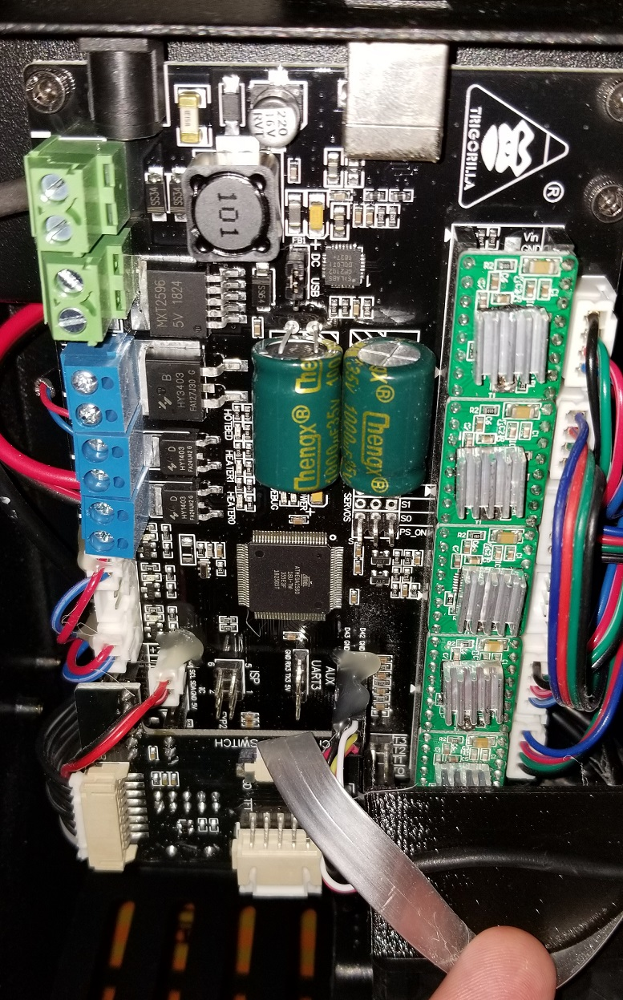

# May 19th, 2020

## Plan

8:00am - Not sure yet, want to maybe try ICBM code today.

11:26pm - ya that didn't happen at all

## Chiron fan

Still no luck getting it to work. I did config the motor itself is fine but the system doesn't turn it on

https://www.youtube.com/watch?v=0JDxsCFWMTA

https://www.reddit.com/r/3Dprinting/comments/9f6p1v/3d_printer_extruder_fan_not_turning_on_when_the/

https://community.ultimaker.com/topic/27138-cura-is-not-turning-on-fan-during-print/

https://reprap.org/wiki/G_code

https://www.thingiverse.com/groups/anycubic-i3-mega/forums/general/topic:19125

Fan0 is Nozzle fan

Fan1 is Motherboard fan

Fan2 is extruder heatsink fan

https://www.reddit.com/r/anycubic/comments/fltuvc/solved_issues_with_chiron_parts_fan_not_turning/

----

https://www.anycubic.com/products/anycubic-chiron-3d-printer

https://www.anycubic.com/blogs/videos/videosall-you-need-to-know-about-anycubic-chiron

Could try updating the firmware

----

https://www.reddit.com/r/anycubic/comments/eghweh/layer_fan_not_working_anycubic_i3_mega/

https://www.simplify3d.com/support/articles/3d-printing-gcode-tutorial/#M106

----

https://www.thingiverse.com/groups/anycubic-i3-mega/forums/general/topic:35319

This link might work, its for the i3-mega but I think the info should be the same for a chiron since its a scaled up version.

----

3:30pm - had a print failure, good news is it didn't damage the layer cooling duct. Bad news is it really wrapped around the head making a mess.

---

Got it working, ended up unplugging the entire connecter to the heater case. Then I turned off the device, turned on reset everything, and plugged it back in. This allowed me to set the fan to 100% in the setup-speed menu. In doing so it started working.

Been running for the last hour without failing. Going to try to send a print through it.

Connecting the octoPrint knocked both fans down to 0%. This might have caused the problem in the first place? Either way sending the same part as earlier through.

Seems to be having first layer issues. Took 2 passes for the skirt to lay down. So far the fan is no on but I expect this for the first few layers.

Still didn't work, going to try printing from the SD card

Seems its failing to detect from SD card any files I try to place on it.

Got some file to detect, no clue what it is but the cooling fan is enabled. So it could be the USB system is failing to turn on the fan?

----

https://www.youtube.com/watch?v=XlHCrh6g8hY

https://www.youtube.com/watch?v=gK1NvI03g7U

Unrelated to issue, just some videos I watched while waiting for print to start.

---

https://www.youtube.com/watch?v=U46msJOh90A

https://www.youtube.com/watch?v=IYFgMbF87PU

https://www.thingiverse.com/groups/anycubic-i3-mega/forums/general/topic:34442

https://community.octoprint.org/t/part-cooling-fan-does-not-work-while-printing/10418

## Pictures from working on the printer

Don't care at all to organize this into my mess of notes above. Logging as it shows the internals of the printer and a few details.

Unclean area under, will need to make a note to find a solution to keep it cleaner

Hot end needs cleaned, otherwise it wills tart to smell like burnt plastic

Fan installed for reference incase I need a replacement later.

## Y Axis Tensioner Broke

Looks like it failed due to stress, will need to print another with better layering

## Desk organizer

Used this as a test print for the cooling layer fan. Took 5 hours to print, didn't record exact but sounds about right

https://www.myminifactory.com/object/3d-print-modular-desk-organizer-82891

## Neat videos

https://www.youtube.com/watch?v=WCEvjRdkjrU

https://www.youtube.com/watch?v=E9pEjYjBv7k

https://www.youtube.com/watch?v=qLm3DPE74Xk

https://www.youtube.com/watch?v=9HrATDeBBXM

https://www.youtube.com/watch?v=zTjbs3Hg2PA

https://www.youtube.com/watch?v=r6_x0wH_1fg

## heat bed replacement

https://www.youtube.com/watch?v=4SUjm9rokZk

https://www.anycubic.com/products/ultrabase-hotbed-platform-plate-for-chirons

Might be easier to remove the existing pad with a scrapper and use build-tak pads? Will need to do research first to see if others have managed it without problems.

## Cup prints

Going to print a cup on both printers to compare quality and to add to my storage options

----

Delta failed short after starting, one of the corners came up off the pad and the printer head just grinded against it for a few mins until I noticed. Missing part of the print is still stuck to the printer. Will have to clean it up in the morning... with sandpaper likely

Flipped over the part and noticed why it failed. A few stranges didn't layer right causing it to lift up. 

Noticed the other side is also very thin. Means the printer is not actually level and is printing heavier on one side then the other side. Might need to look up the gcode to run for alignment. As I know these printers can break alignment. Even though in theory they are self aligned and should correct for any issues.

Other theory is that a section of filment got under the sensor during alignment. I did notice a few floating on the pad during start. Its not uncommon for this to happen with the mini-delta. Its why I want to get head wipe code to fix for it.

---

Other print is looking good but likely will not finish until the morning

