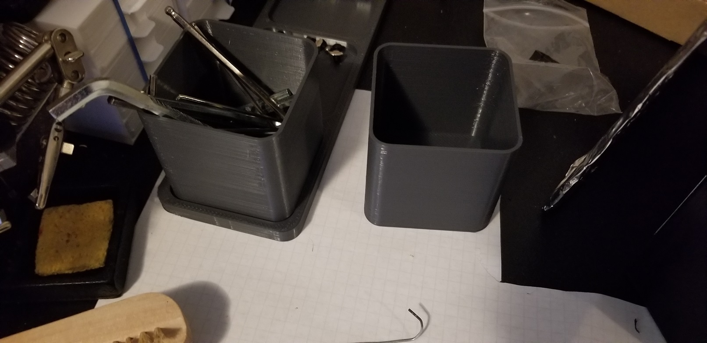
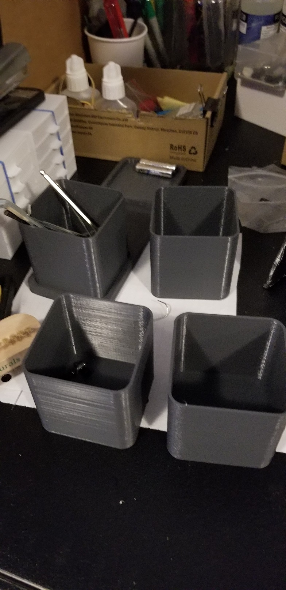
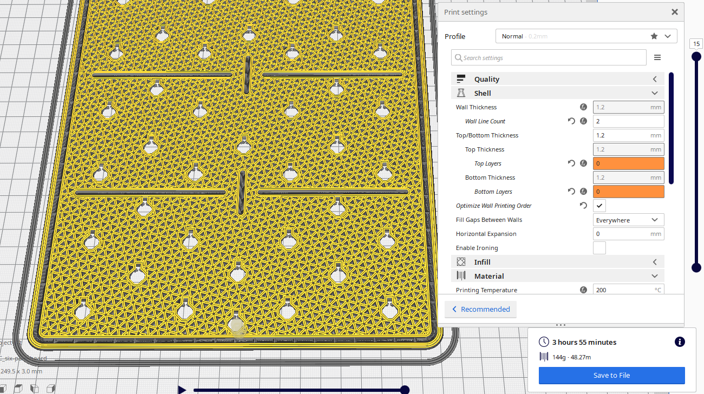
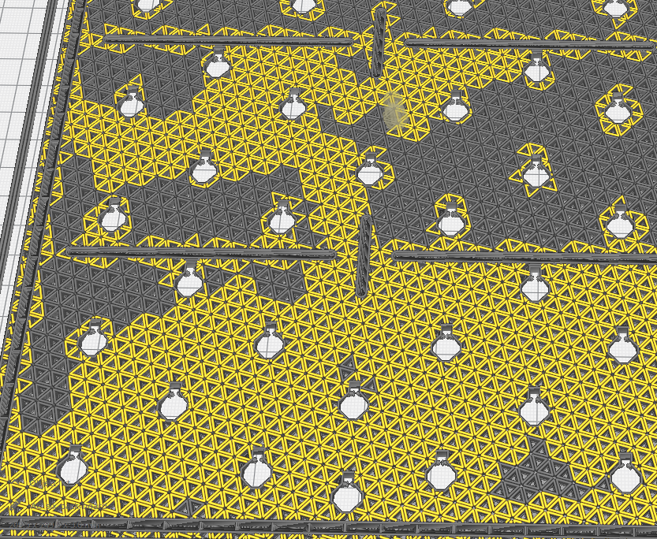
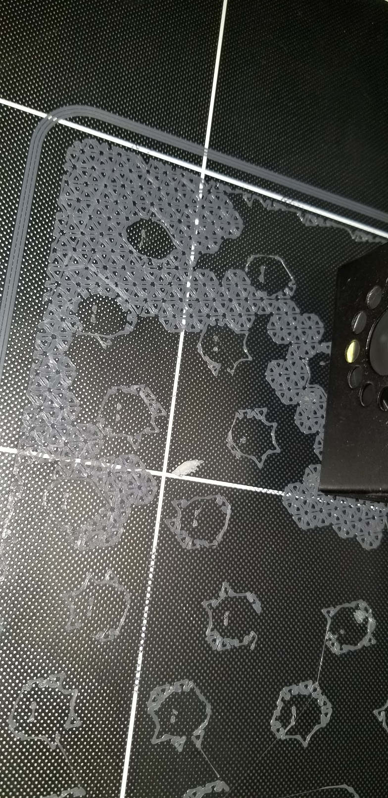
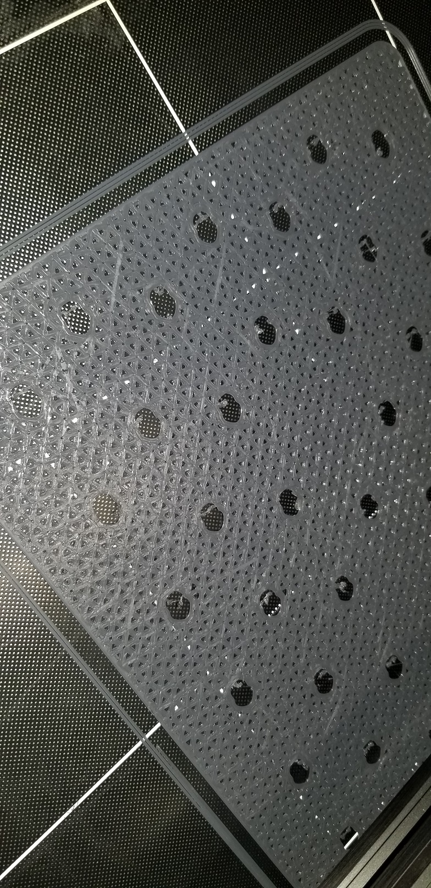

# May 20th, 2020

## Cup prints

Cup prints have turned out well, ended up printing out 4 of them taking less than 2 hours for each.





## Sixpack modular bulletin organizer

https://www.myminifactory.com/object/3d-print-sixpack-modular-bulletin-organizer-116789





Looks like its going to fill in 1 small triangle at a time. Likely going to fail but it it works it will be wonderful looking.

Printing with 50% infill with triangle supports, no top, no bottom, 2 line thickness on walls and infill






First layer went down well, only minor issues but decent considering its not designed for small details like this.

## CDLord start gCode

```gcode
;Start Code:
M666 X0 Y0 Z0        ;Add your endstop values here after calibration
M665 L123.0 R63.5 S120    ;Sets default Delta Radius (change when calibrating)
M851 Z-0.45        ;Put your z-offset here for Marlin4MPMD. It needs to be negative
G90     ;switch to absolute positioning
G92 E0    ;reset extrusion distance
G1 E20 F200    ;purge 20mm of filament to prime nozzle.
G92 E0    ;reset extrusion distance
G4 S5    ;Pause for 5 seconds to allow time for removing extruded filament
G28    ;start from home position
G1 E-6 F900    ;retract 6mm of filament before starting the bed leveling process
G92 E0    ;reset extrusion distance
G4 S5    ;pause for 5 seconds to allow time for removing extruded filament
G29 P2    ;Full 7x7 Mesh. Do not put z-offset here for Marlin4MPMD
G1 Z30    ;raise Z 30mm to prepare for priming the nozzle
G1 E5 F200    ;extrude 5mm of filament to help prime the nozzle just prior to the start of the print
G92 E0    ;reset extrusion distance
G4 S5    ;pause for 5 seconds to allow time for cleaning the nozzle and build plate if needed
```

## Prints to try

https://www.thingiverse.com/thing:1997048