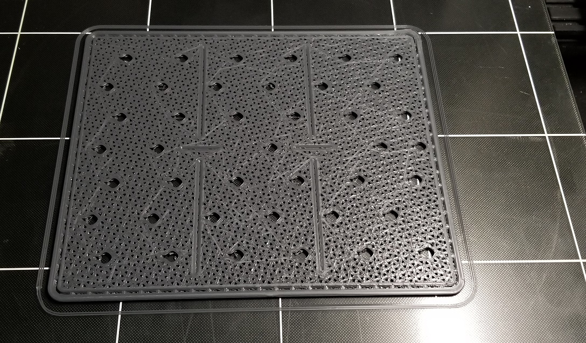
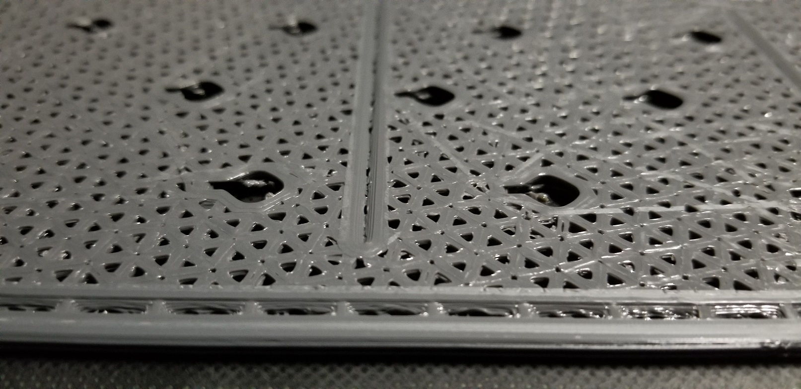
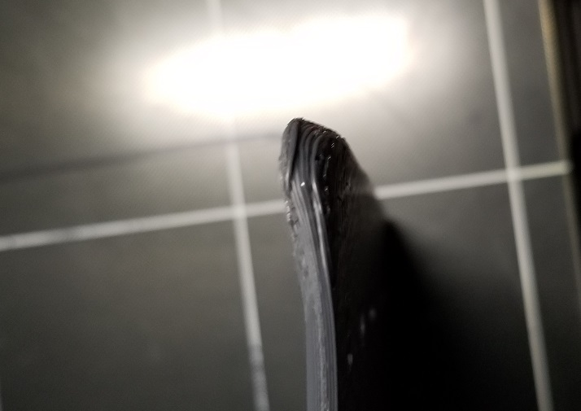
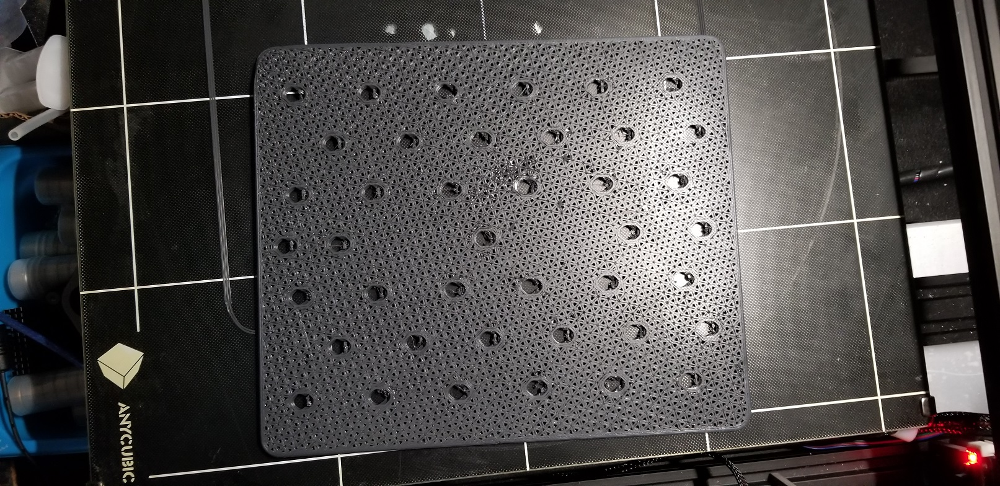
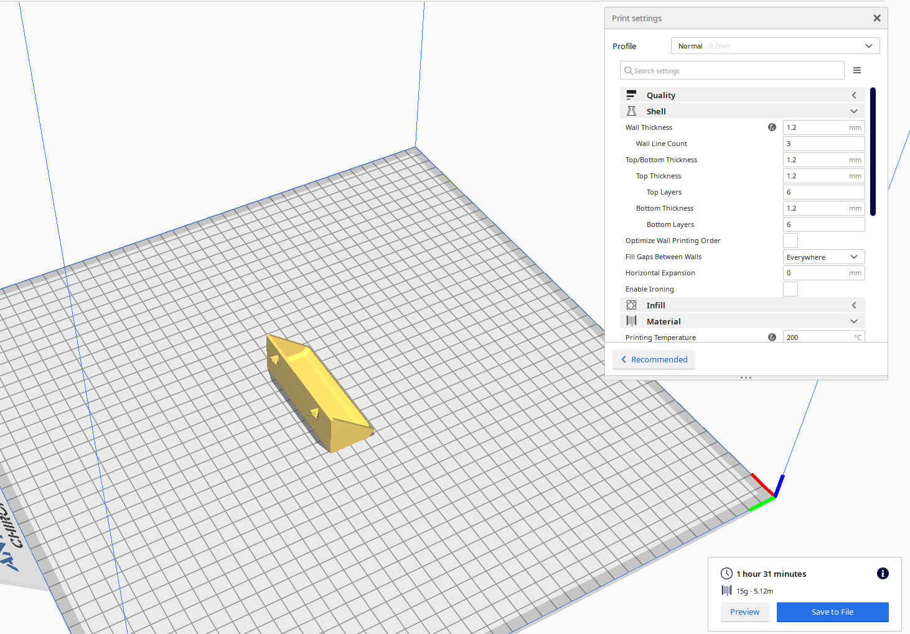
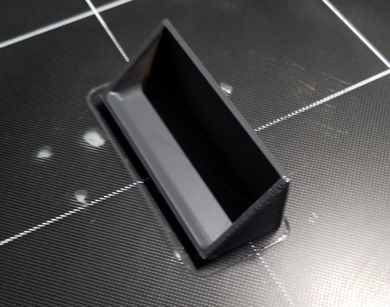
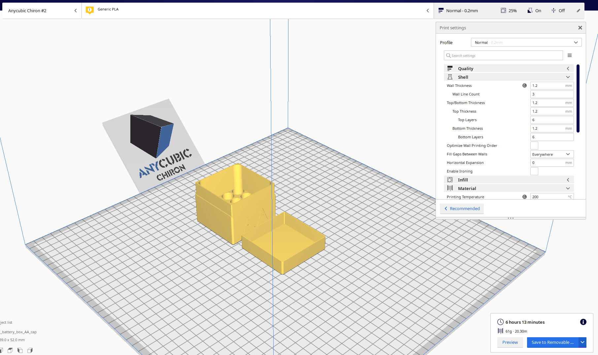

# May 21st, 2020

## Plan

Nothing so far

## Six pack

Print turned out well, according to the UI on the machine it took 11 hours and 12 mins to complete. Originaly estimate was 4 hours, so this is way longer than expected. Think I need to toy with the cura profile to fix the estimations.

For the most part it turned out good, detail is nice and no major issues

One of the corners did warp and possibily delayered in printing

Back doesn't show anything major, only some spots where it picked up the holes in the pad.

Holes did take some cleanup and I suspect will take more once I print some parts to go into them.

## Six pack short box

Next Going to try to print one of the short boxes that goes into the holes

First print failed, unknown reason but found a blob of plastic around the head

Second print failed due to catching some wires, will need to move the light at some point to solve this

Third print failed, filment exported very string like and failed to bound to the pad. Took 2 passes for it even to export filment. 

4th print failed for the same reason. I think the alignment is very messed up.

Toyed with it a bit, realigned the pad... it was badly out of alignment. Still the first few lines didn't go down well... after that it was perfectly fine. Thing I need to perge the head before the start.

Also the bed is heavily warped, it has a high spot in the middle in almost a curved shape. Entirely due to heating and cooling likely. I need to look into replacing it with a steel sheet or metal sheet of good thickness. This way it doesn't warp as easily.

I also Had a though to add some system to detect the head for damage. As I noticed the head has a slight uneven nature about it. This is likely due to hitting the pad at some point. I noticed in the back areas there are scratches from yesterday's print.

Ended up printing well but didn't fit into the slots. Looks like the tolerence was too high.

## Light bar

Got my light bar in, cord is very short and contains no mounting points. Ended up just taping it down to a 2x4 on my desk.

## Light Mount

https://www.thingiverse.com/thing:3361566

https://www.thingiverse.com/thing:2521046

https://www.thingiverse.com/thing:3633262

https://www.thingiverse.com/thing:3371832

Might have to design one

## Neat videos 

https://www.youtube.com/watch?v=qub5chyIQ0s

## AA Holder Box

https://www.thingiverse.com/thing:4013632

## AA Holder Box

https://www.thingiverse.com/thing:4013650

Should try this next