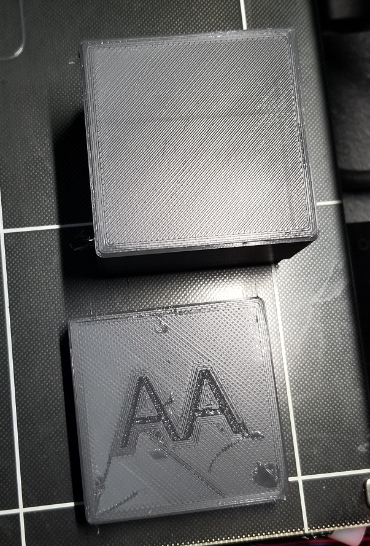

# May 22nd, 2020

## Plans

Work on 3D printing and maybe code on a mod

## AA Holder

Print finished in 7 hours and 30 mins. Quality looks decent but has a lot of cosmetic issues. Parts do not fit together due to tight tolerances. Batteries do not fit into holes due to tight tolerances. Likely need to print it with a smaller head for it to work without post processing.

## Burning smell

Smelt something plastic like burning in the office area. Found some discolored tape near cables but not sure it is the source.

## Neat videos

https://www.youtube.com/watch?v=NCDBpO4b-hs

## Oil change on car

https://www.youtube.com/watch?v=U6qxBuBE8fk

15mm socket to remove drain plug

32mm socket to remove filter

Oil filter is next to dip stick and is a little black cap

https://www.youtube.com/watch?v=GldIQqioLDY

4qts -> check level -> then add a half a qt -> turn on car to work oil through engine -> check level again -> add last half qt -> Should see all 4 bars on dip stick.

Rest light by going to OIL life then press gas peddle 3 times -> do within 5 seconds, 3rd time it shoudl reset to 100%

https://www.autozone.com/external-engine/oil-filter/chevrolet/cobalt/2007

## Code advice

Game some code advice and feedback in MMD. Got this amazing work of art in return.

 Especially given I setup a challange to send me the worse code possible.

https://www.reddit.com/r/badcode/comments/bjsdyc/my_teach_kees_getting_mad_that_i_never_properly/

Another fun one https://www.reddit.com/r/badcode/comments/enowuw/my_daughter_discovered_this_from_when_she_was/

https://www.reddit.com/r/badcode/comments/gl3fg8/say_it_with_me_its_a_feature/
