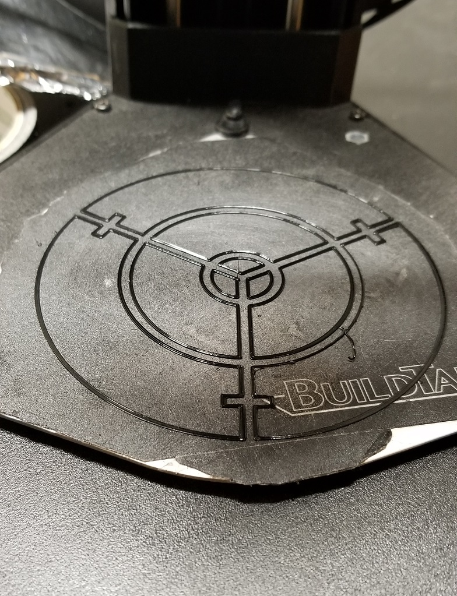
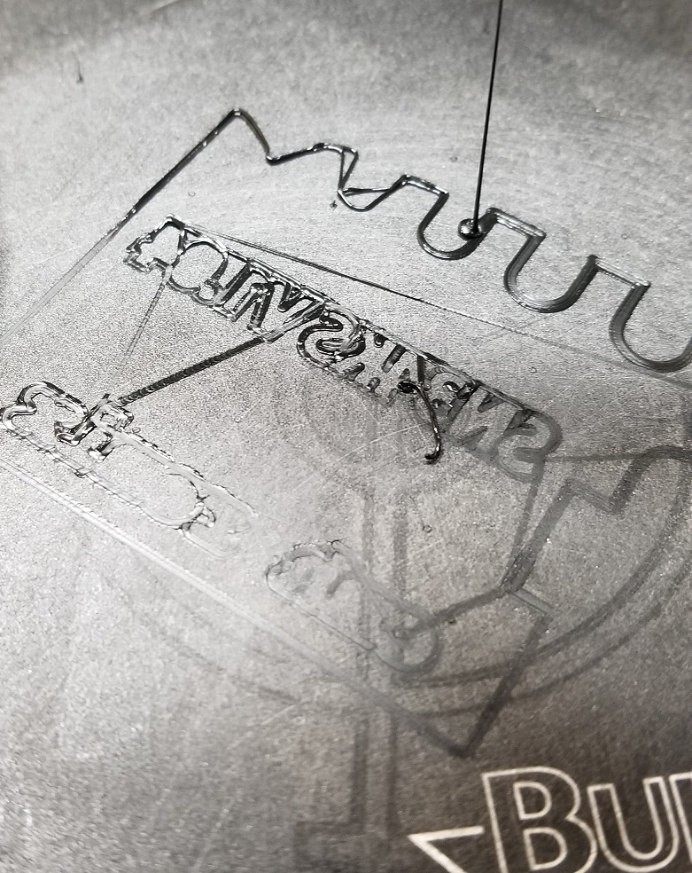
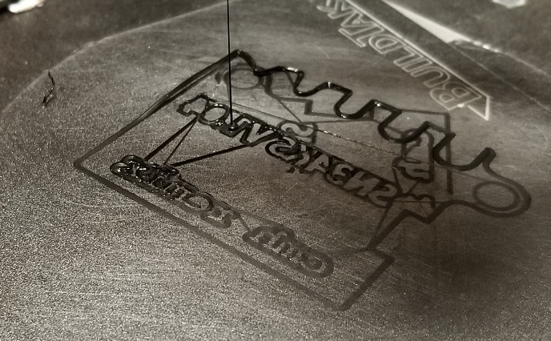
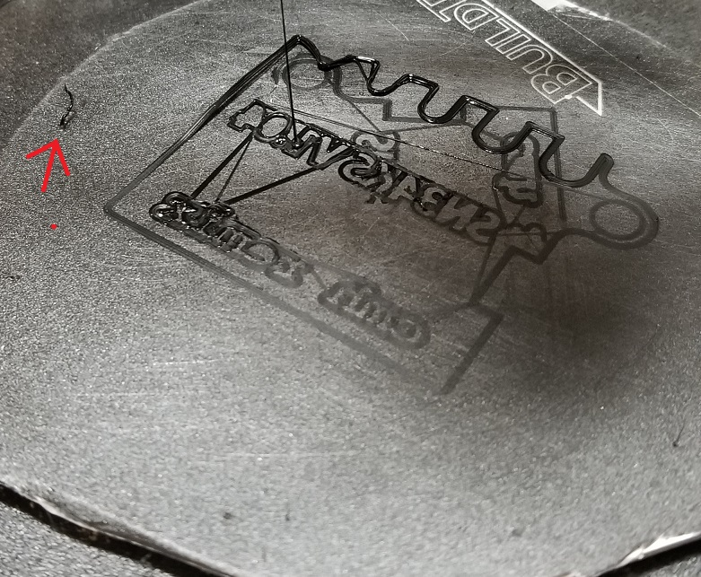

# May 24th, 2020

## Plan

No idea, might work on mods

## Shop power bar

Honestly don't know the proper name for it.

## Leveling issues

2am I tried to level and reprint again, it failed again

Leveling looked good, I cleaned under the plate as well and found some plastic under it. My thoughts were it could have thrown off the leveling process.

Not sure this is actually a leveling problem but has that feeling. You can see one side is very thick and the other very thin.

Can also see in the middle near the lettering that filament from the start up process got caught under the print. Tried to remove it at the start but was too slow.

----

Worked on the problem more, I rotated the bed to see if it was a warping issue. It still failed to print in the same exact way. So either the bed wrap effects the same zone or the whole machine is messed up. Since this is unlikely for both cases it is likely a different issue entirely. 

As you can see the bed is rotated with the logo on a different size. Yet the failure is in the same exact spot with the top left side failing to stick.

---

Did a 3rd print and managed to clean the head before it printed. This didn't matter at all and it still failed. So I think it is a sensor issue at this point and am going to adjust the g-code

---

4th try i'm going to use default settings with a brim. Just want to rule anything out at this point. Also switched to a sanitized version of the print that lacks logos on the back and a key ring attachment.

Failed right away, same corner didn't stick but this time it was the brim.

---

https://www.mpminidelta.com/starting_ending_g-code_scripts

Going to try the start and end code from this example.

Failed but not due to the g-code. Noticed the very back the head lifts up then goes back down. This is why that corner is failing. As the filament is printing in the air.

---

calibration print on the SD card worked perfectly. So not even sure its a sensor issue if it can go down just fine.

---

## Spell checker

https://marketplace.visualstudio.com/items?itemName=streetsidesoftware.code-spell-checker

Installed 'Code Spell checker' into VS code. Works well so far and is catching issues in real time. Only thing I need to adjust is the hot key for quick fixing.

## Neat videos

https://www.youtube.com/watch?v=61fwAqvXPN4

https://www.youtube.com/watch?v=xkFS77GlFkY

https://www.youtube.com/watch?v=8HWGFWo_KTc

https://foobot.io/

https://io3dprint.com/air-quality-monitor-3d-printing/

https://3dinsider.com/3d-printing-fumes/

https://3dprintingcanada.com/blogs/news/the-importance-of-ventilation-and-your-3d-printing-workspace

https://www.instructables.com/id/Easy-and-Cheap-3D-Printer-Fume-Hood/

https://www.sentryair.com/3d-printing-fumes.htm

https://learn.kaiterra.com/en/air-academy/how-tvoc-sensor-work

https://www.sparkfun.com/products/14193