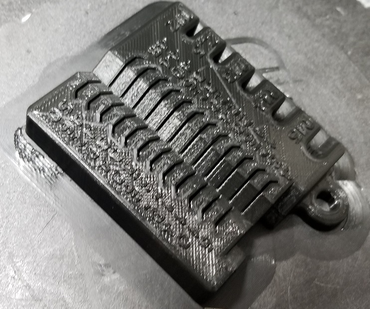
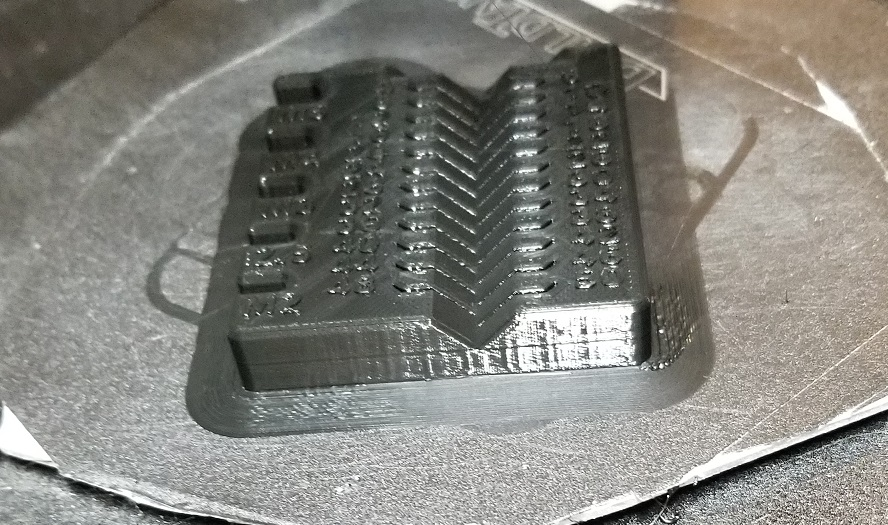
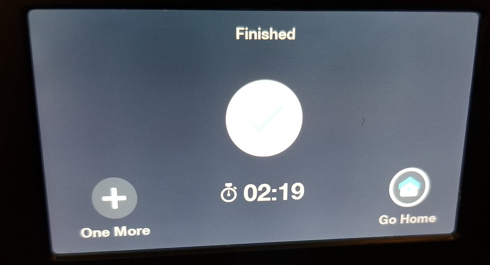
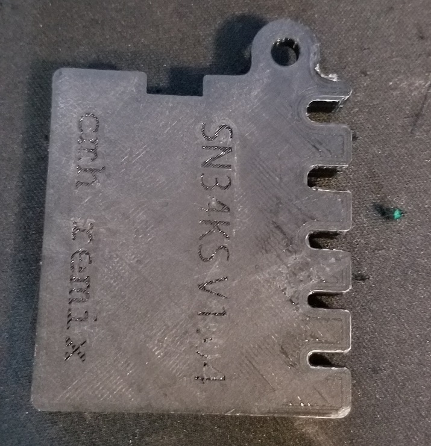
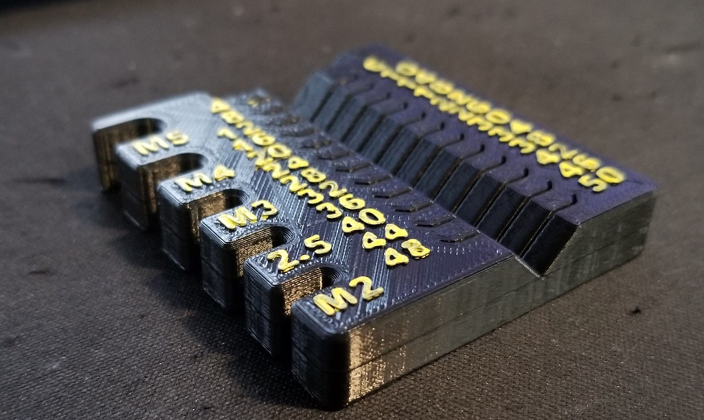
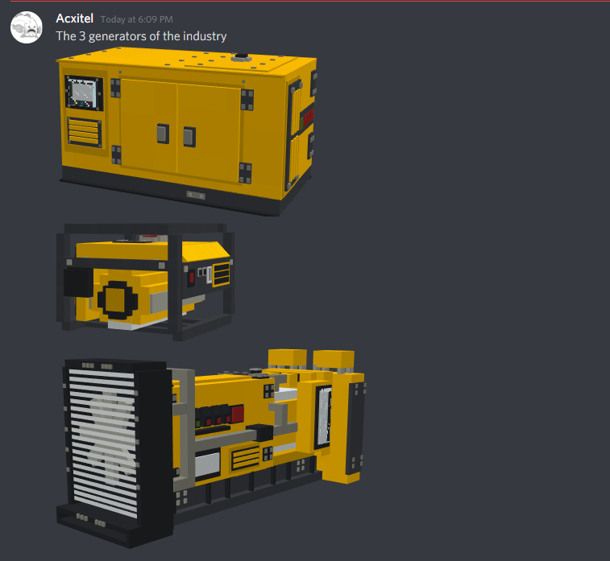
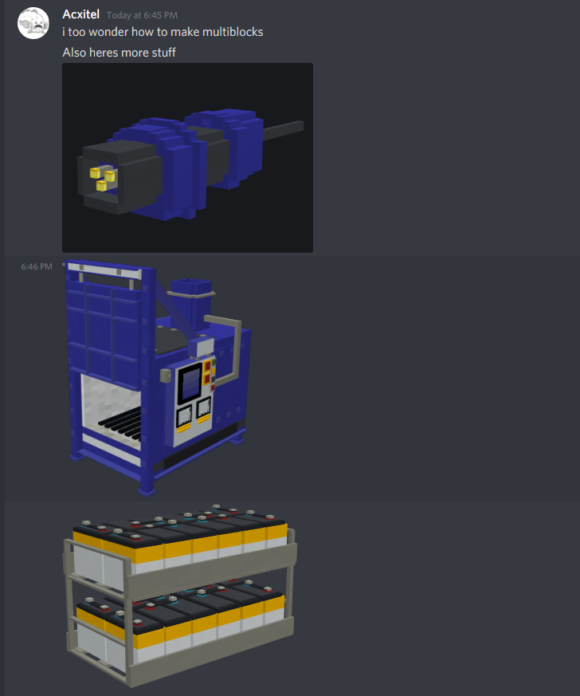
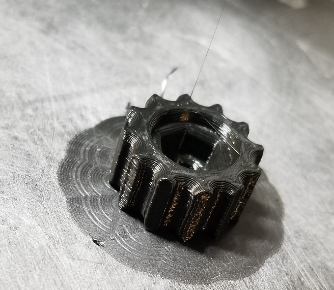
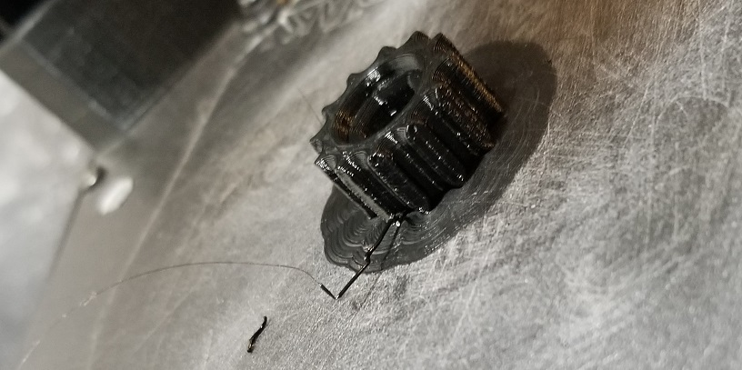
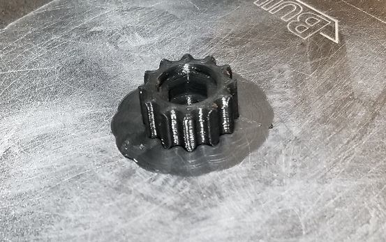

# May 25th, 2020

## Plan

No idea

## 3D printer leveling

https://www.reddit.com/r/mpminidelta/comments/7wpgg7/having_trouble_leveling/

https://www.reddit.com/r/mpminidelta/comments/7u2ecz/hack_for_fixing_weird_bed_leveling/dtiulvw/

https://www.mpminidelta.com/howto/extruder_calibration%E2%80%A6

https://www.youtube.com/watch?v=AYugJbPkM6Q

https://www.youtube.com/watch?v=bAem1Q179vw

---

Going to try `G29 C-0.8 Z0.3`

Seems to be working, it still has some issue with the 1 side being high and the other low. Yet it is printing much better then previous iterations.

Noticed while it is printing the head hits the bed on the left side. Enough that it clicks the front left sensor down. It might be possible that the issue is not that the back is high but the front is low?

---

Print came out well. I think the 3 point system is better than the other options. It still was a bit high one the one side. However, it managed to print the part without major issues. Only issue was cosmetic and involved missing lettering on the back. Which honestly was expected due to the small size.

## MC Generators

Spotted this in showcase of MMD, looks very nice

https://discordapp.com/channels/176780432371744769/232644586638540811/714601153265926174

## Neat videos

https://www.youtube.com/watch?v=a4u-pJmIUek

## Sanding block

Decided to 3D print a sanding block, mostly out of desire to keep the printers running

https://www.thingiverse.com/thing:2259838

First thumb nut turned out well, took 19 mins on the mini-delta according to the screen. Which oddly enough is tracking the time again. It was broken for the longest time.

Can see some slight blobs on the print and looks like filament got trapped under it.

---

Noted the screen keeps flickering in the MMD. Might be a sign it doesn't have enough power to run the whole thing.

I Also need to add bearings to the filament roll. As the retraction is kicking hard enough it makes noise as the filament snaps back.

---

Second thumb turned out good as well

