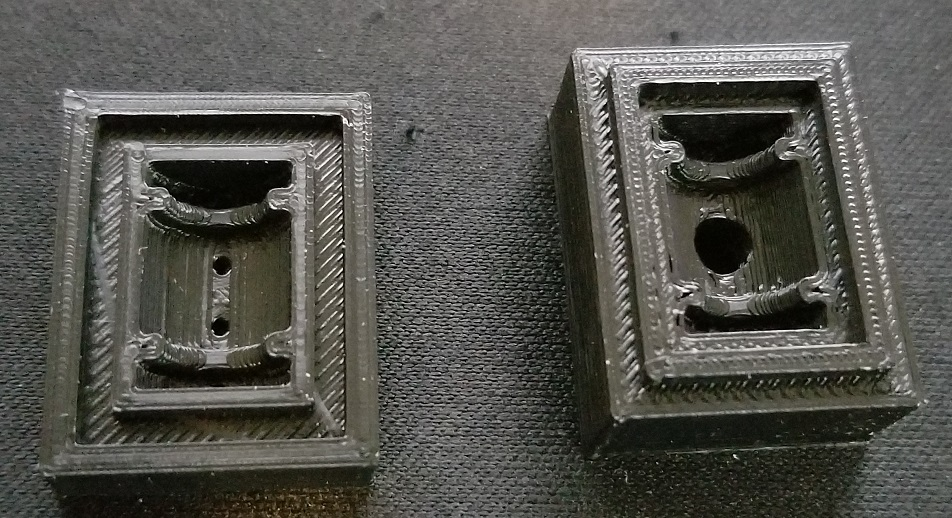

# May 26th, 2020

## Plan

## Sanding block prints

Last two parts printed overnight and turned out well

Not noticeable issues and a good print time

---

This part had a bit more cosmetic issues. Mainly with stringing on the bottom side. Over all the part is good.

---

Fully assembled it looks good but I got the wrong clamp installed.

---

Printing new clamp to see if it fits better

10:45am - Printed in 1 hour 1 min according to delta display. This sounds about right as I started it roughly an hour ago

No cosmetic issues noticed, though it looks slightly higher on 1 side then the other. This seems to only be a print bed issue and not a problem with the part itself

---

Put the new clamp on after light sanding. 

Will need to sand more later as the bottom of the sanding block is not flat. It has a slight grove in the middle due to what looks like z-banding?

Image is a bit blurry and I can't be bothered to take another. Even with that issue it can be noted that left & right have a different pattern then center. This is with light sanding to smooth out the lines. For feel it is very noticeable even before I started sanding

---

Also noticed I lack sand paper to fit this large block. Even if I did have some I really don't have much use for the tool. As my sanding is often small scale and lacks the requirements for larger surfaces. Though I could use a flat bolted down sanding block. Might go look for a new file later.

## Mushroom container

Attempted to wash a mushroom container in the dishwasher. Fully knew this was going to fail as most of these containers are low temp plastic. Usually made using vacuum pulling over a mold.

Still was neat to see what would happen and all I need to do is hand wash these in the future. As I want to recycle then as part bins since they are light weight and have a nice blue color.

## Prints to try

Customizable Sanding Stick by mightynozzle June 26, 2017
https://www.thingiverse.com/thing:2404850

I like how this includes plastic screws but have concerns if they will print well. Other than that its the same style of tool as the one I printed. Just a different design an some new options.

---

Sanding Tool by Perinski October 16, 2018
https://www.thingiverse.com/thing:3159240

I like the look and function of this design. However, I have concerns about the complexity of printing the parts.

---

Sanding Block Remix by NZbot January 16, 2016
https://www.thingiverse.com/thing:1273771

I Sorta like the simple design but not sure how well it will work. That said it uses small sandpaper spots so might work nicer.

----

Sanding Block (5" & 6" Sanding Disks) by mussy August 20, 2018
https://www.thingiverse.com/thing:3058711

These seem simple enough but I don't think I have the hardware to make them.

----

Basic Sanding Blocks by RedJoe June 09, 2019
https://www.thingiverse.com/thing:3681084

Love the flat shape of these. Might work for my needs by flipping it over. Comes with its own screws as well which is a plus. Though I have not had much luck printing screw threads.

----

Simple Sanding stick by airlid February 07, 2020
https://www.thingiverse.com/thing:4148991

## Random prints

AA and AAA Battery Holders (2, 4, 8, 12, 16 packs)
by mistertech July 03, 2016

https://www.thingiverse.com/thing:1657086

----

Filament Spool Roller by mistertech April 14, 2017
https://www.thingiverse.com/thing:2250077

----

Gorbo Tankoped by steyrc February 10, 2015
https://www.thingiverse.com/thing:675762

----

DIY Vibration dampers by iClint May 11, 2018
https://www.thingiverse.com/thing:2905601

## Dampener Molds

https://www.thingiverse.com/thing:2905601

Going to try to print these to test the silicon kit I ordered. I lack release agent but I also want to see what happens without it.

---

Took 46mins to print the smaller of the two. Fits perfectly together and no major issues. The inside does look a bit rough but honestly not sure this matters. Worse case this result in the mold not turning out well.

---

Large mold took 2h 5mins to print. The quality is also good but the fit is slightly off. This mold also requires a pin down the middle

## Drone mod

MCreator based mod that adds drones. The code is worthless but I like the models. Might make a point to invest into making my own later.

https://www.curseforge.com/minecraft/mc-mods/drone-craft

https://www.youtube.com/watch?v=-CMO3UOYgWY

## Mold release workarounds

Since I didn't buy any I will need to find a temp solution until I have a chance to buy more.

https://www.hunker.com/12597872/resin-mold-release-substitutions

Might be able to use vegetable oil

---

https://www.youtube.com/watch?v=krJ8qpT8cL4

Not very useful

---

https://www.therpf.com/forums/threads/alternatives-for-mold-release-agents.100352/

https://www.therpf.com/forums/threads/cooking-spray-for-mold-release.113541/

https://www.reddit.com/r/ResinCasting/comments/1y84nz/pam_as_mold_release/

https://www.smooth-on.com/support/faq/94/

----

https://www.makerbot.com/professional/post-processing/silicone-molding-1/

This seems to be for mold making

----

https://www.makerbot.com/professional/post-processing/silicone-molding-2/

Useful information, they recommend a spray which I will order later if I care to continue beyond toying around.

## Funnel

Next problem to solve is how to get the silicon into the mold. It has a small hole but doubt I can eyeball it with a cup. Easy solution is to 3D print a funnel.

---

Parametric funnel by Shii September 10, 2016

https://www.thingiverse.com/thing:1763508

---

Took 15 mins to print and came out rather well. Did have stringing issues inside which I tried to solve with a lighter. This resulted in the part melting slighting. I sanded it and tried heat again to clean up the sanding burrs... this made it worse XD

----

Printed a second one just to see if I can clean it better. Still didn't come out that well and ended up only using the first.

---

It failed for the purpose, the funnel was not wide enough to handle the thick fluid. So I ended up just making a mess and forcing the fluid into each mold by hand.

---

Let the molds sit for a few hours while I worked on my car at my mom's place with my brother's help. 

The result of the molds was rather good. The small one came out perfect but a little sticky. 

The large one was not filled well enough and was also sticky. 

I cleaned bother in rubbing alcohols which seems to have fixed this problem.

## Worked on car

Changed the oil in my car with my brother's help. The tools I bought failed to work so we used his large heavy set wrench. This almost didn't work as both the oil bolt and cap were on too tight. The oil was also very very dark to the point my brother wondered if it was changed at all last time. The new stuff seems to have worked well as the car runs better.

## More art from Acxitel

This guy does some amazing work

## Silicone

Ordered more silicone for mold making: Smooth-Sil® 940

https://www.smooth-on.com/applications/food-applications/
