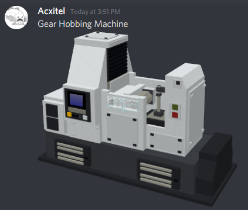
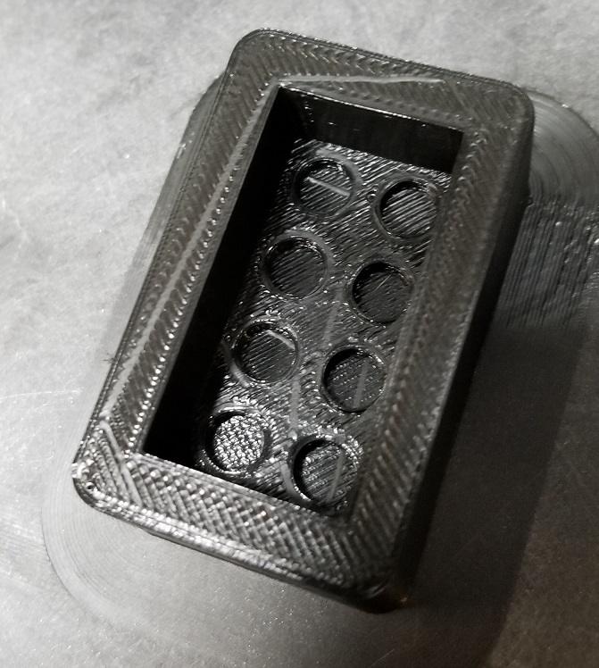
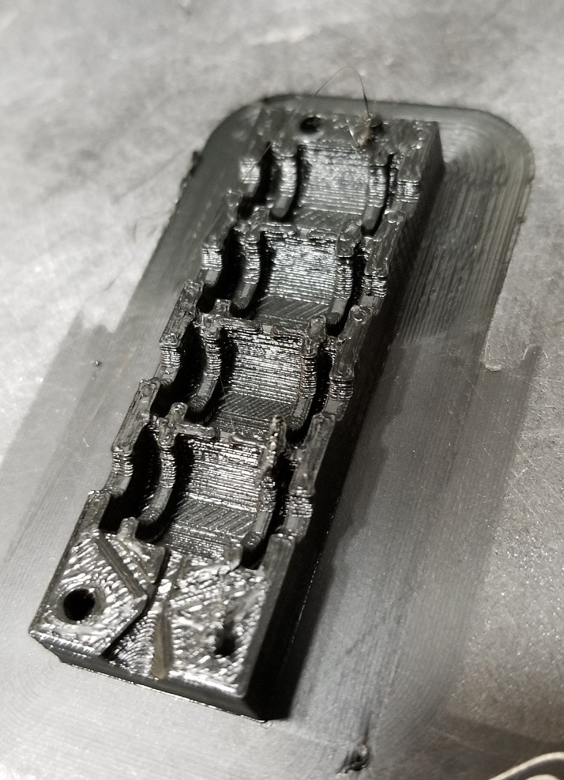

# May 27th, 2020

## Plan

Work on printers

## Machines by Acxitel

## Working on app to list file names

https://stackoverflow.com/questions/6582171/javascript-regex-for-matching-extracting-file-extension

https://www.w3schools.com/nodejs/nodejs_filesystem.asp

Worked out perfectly

## Printing more molds

Didn't include a cap to ensure it contains holes on the other side. Assume it was design for candy

Printed 4 of the above, not sure they will work well due to small fill area

Printed some NSFW ones as well, not including pictures but did it mainly for lolz.