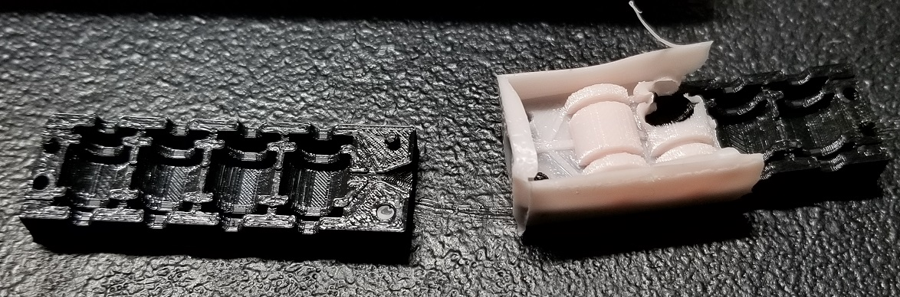

# May 28th, 2020

## Plan

3D printing and coding if time allows

## Molding

Going to try to mold something large with the food safe silicon I just got

Casing is 2in diameter 5.5 inches tall, core is 1in diameter 5.5 inches tall

https://www.alumilite.com/volume-calculator/

According to this the volume would be roughly 13in^3

Converting to ml as I plan to use a pair of 20ml oral fluid syringes to measure it.

213ml converted, lets round up to 220 to have extra incase of problems

Mix is 2 parts, 10:1 ratio of mix, with 30min cure time. Smooth-sil 940

200ml of part A, 20ml of part B

---

Part A was very very thick, to the point I couldn't use a syringe. All it did was go slightly up into the body and then fail. So I ended up scrapping it into the cup manually. This means the measurements are likely off but I did some rough calculations to check the ratio was at least close.

Part B worked fine with the syringe and turns out the stuff is pink. I should have checked that first before buying but eh its a learning experience.

After it was mixed it got a bit more liquid like and easier to deal with. I slowly poured it into the mold and use a syringe on some of the remaining to test how well it injects into the smaller molds. This didn't go all that way and honestly I need to learn to seal my molds better. As every single mold is dripping fluid.

I should invest into a vacuum system to reduce bubbles. As I noticed a few at the top of the mold meaning there could be large ones inside it.

## Sanding block

Since I got my M5 bolts today I revisited the sanding block to install them. The fit was very tight and required a lot of work. I'll need to consider this in the future when 3D printing holes. I eventually used heat and drill to get the bolts installed. Then glued them in place to prevent them from falling out.

I think a press might be useful to press fit the bolts and nuts.

Also could use some small chisels to help clean up the slots.

## Opened molds

I Know it said 24 hours but I noticed they were already hard. Sadly they were super hard and I was hoping for a medium range. These ended up almost rock like with only a little flex. Would make for great handles of tools but not for food molds.

Small mold came out well, it has flash but was good

Larger mold still had issues with the top being under filled. Hard to see in the picture due to lighting

Lego mold didn't fill very well due to air bubbles

Multi-mold didn't work due to small spread areas. If the mold was better fit together I likely could have added more pressure.