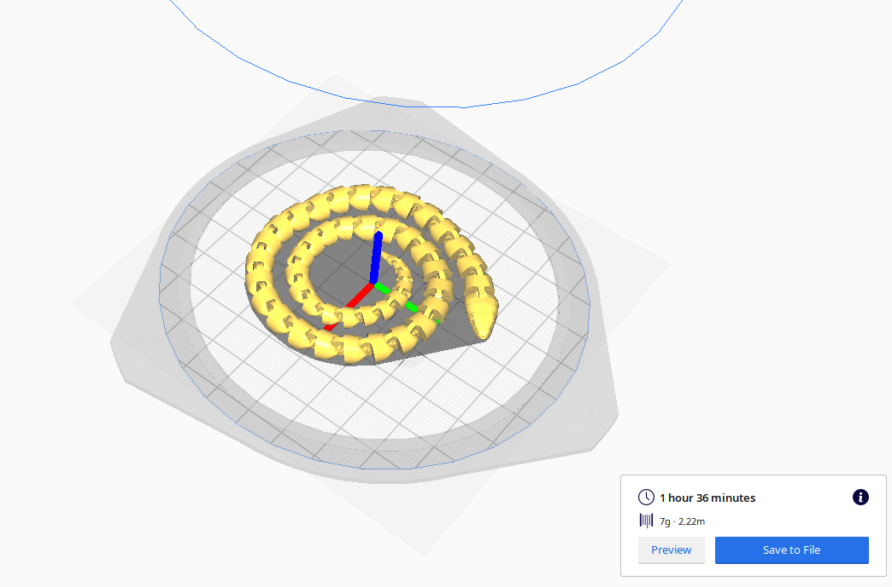
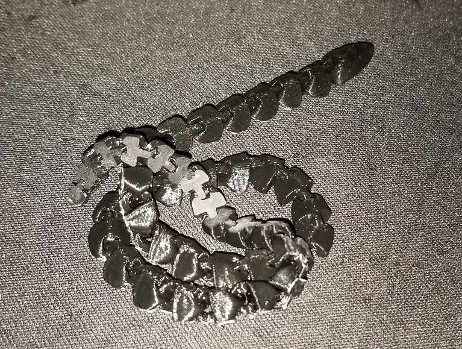

# May 29th, 2020

## Plan

Software projects maybe

## Sand block + glue

Noticed after the glue dried it rose in a bubble. I saw this yesterday but thought it would collapse. Today it was rock hard and filled in a foam like state. I managed to remove it with a knife but rather odd outcome. I think this is by design since I used gorilla glue. I think it is meant to expand into cracks to ensure a good bound. Will have to remember this for later as it can be useful.

## Snake thing

Want to see how this would turn out

Took an hour and 29 minutes to print, Result is good but was hard to remove from the print bed. I also regret using the brim as this resulted in a very hard post processing

Still very neat little toy, the joints are rather cool and worked even at 50% scale. The very tip of the tail did break due to how small it was. Going to try a full scale version later.