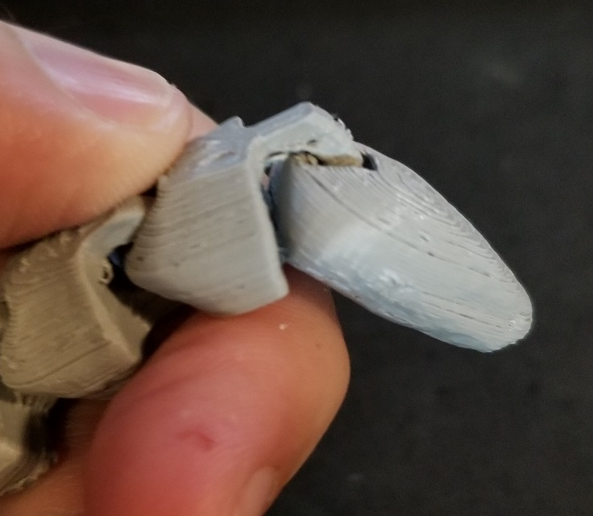

# May 30th, 2020

## Plan

No idea

## Snake

https://www.thingiverse.com/thing:3674315

Printing a larger version of the snake to see if it works better

Print quality turned out well but was a pain to clean up. Need to see if printing without supports will work better.

## Killing floor

Noticed this a while ago but took a picture with my phone today. In the game the C4 charge looks like an arduino 

Not these exact models but the idea is there. Amazed I have not heard about anyone in real life using them. Since they are extremely cheap and could easily be used for this exact purpose. After all you don't need much to set one off.

Might make an interesting idea for a video game. Likely already more games that have used it... just honestly I don't play that many XD

## Mold 

Got some 00-30 silicon earlier today so going to retry molding again.

mold 5.5mm diameter x 14.5mm tall for the casing

2.5mm diameter x 14mm tall for core

using google

230.61 for shell volume

68.72 for core

161.89 required

cup is 8.5mm roughly in diameter

If we make a 200 volume batch then I need to do up to 3.52mm height in the cup

I clearly failed at math as I only did roughly 80% of what was required. Though a good bit is leaking out of the sides of the mold. I think I need to trim this mold and check for fit. As well consider glueing the mold together before filling it up with material.

The smaller molds seem to have filled rather easy but this silicon is much more liquid then the previous two iterations. The dye on the other hand has taken rather well and looks amazing. Down side is my fingers are now green and I should consider gloves next time.

## 3d printing metal

https://www.youtube.com/watch?v=DKkcBoSeUOg

https://www.youtube.com/watch?v=da5IsmZZ-tw

https://www.youtube.com/watch?v=QGy9rv40E-w

## 3d printing factories

https://www.youtube.com/watch?v=YOpko6P-QT0

https://www.youtube.com/watch?v=BjoQw5fGk6Q